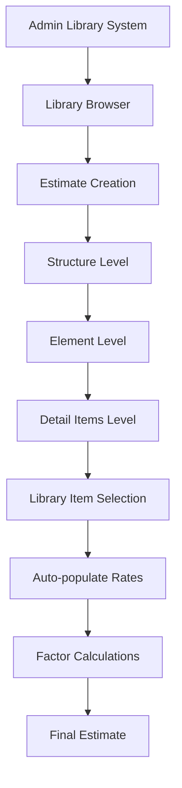
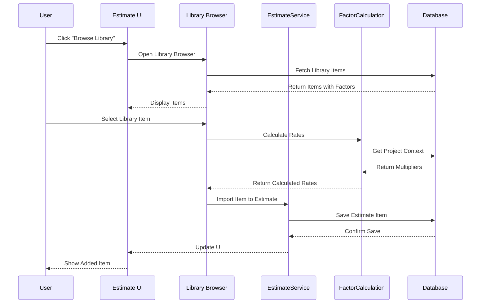
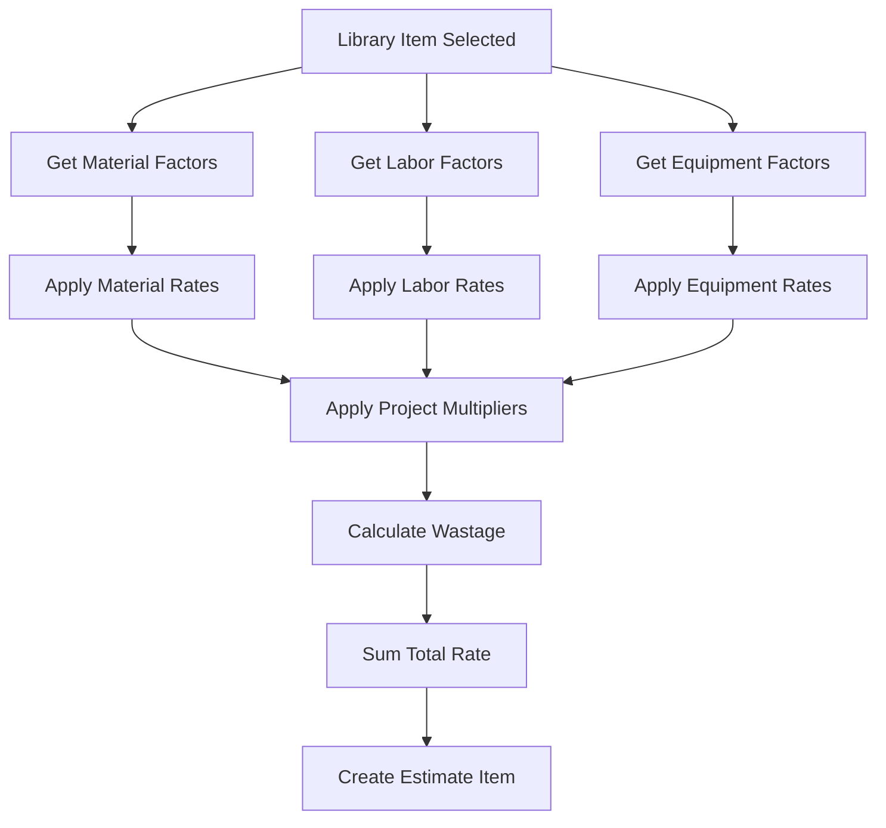

# Estimate Library Integration Guide

**How to Use Admin Library System for Estimates While Maintaining Structure and Elements Functionality**

## Table of Contents

1. [Overview](#overview)
2. [Current Estimate Workflow](#current-estimate-workflow)
3. [Admin Library System Overview](#admin-library-system-overview)
4. [Integration Strategy](#integration-strategy)
5. [Step-by-Step Implementation](#step-by-step-implementation)
6. [Technical Implementation](#technical-implementation)
7. [User Workflow Examples](#user-workflow-examples)
8. [Data Flow Diagrams](#data-flow-diagrams)
9. [Maintaining Existing Functionality](#maintaining-existing-functionality)
10. [Best Practices](#best-practices)

---

## Overview

This guide explains how to integrate the Admin Library system with the Estimate workflow to replace manual item entry while preserving the existing Structure and Elements functionality. The integration allows quantity surveyors to:

- ✅ Leverage standardized library items instead of manual entry
- ✅ Maintain the 3-level hierarchy (Structure → Elements → Detail Items)
- ✅ Auto-populate rates, units, and specifications from library
- ✅ Apply factor-based calculations (Material + Labor + Equipment)
- ✅ Ensure consistency across projects and estimates

---

## Current Estimate Workflow

### Hierarchical Structure (3 Levels)

```
📁 Project Estimate
├── 🏗️ Level 0: Structures (Main building components)
│   ├── "Main House"
│   ├── "Garage" 
│   └── "External Works"
│
├── 🧱 Level 1: Elements (Sub-components within structures)
│   ├── "Substructure"
│   ├── "RC Frame"
│   ├── "Roofing"
│   └── "Finishes"
│
└── 📋 Level 2: Detail Items (Specific work items with quantities)
    ├── "Excavation - 100m³ @ $25/m³"
    ├── "Concrete Grade 25 - 50m³ @ $150/m³"
    └── "Steel Reinforcement - 2000kg @ $2.5/kg"
```

### Current Data Models

**Legacy System (Single Table):**
```sql
estimate_items {
  id, parent_id, level, name, description, 
  quantity, unit, rate, amount, project_id
}
```

**New System (Three Tables):**
```sql
-- Level 0
estimate_structures {
  id, project_id, name, description, sort_order
}

-- Level 1  
estimate_elements {
  id, structure_id, name, description, sort_order
}

-- Level 2
estimate_detail_items {
  id, element_id, name, description, quantity, 
  unit, rate, amount, specifications
}
```

---

## Admin Library System Overview

### Hierarchical Organization (4 Levels)

```
📚 Admin Library System
├── 🏭 Divisions (Level 1)
│   └── "02 - Concrete Work"
│
├── 📂 Sections (Level 2)
│   └── "02.10 - Cast-in-Place Concrete"
│
├── 🔧 Assemblies (Level 3)
│   └── "02.10.10 - Footings"
│
└── 📝 Items (Level 4)
    └── "02.10.10.01 - Strip Footing 300mm"
        ├── Material Factors (cement, aggregate, steel)
        ├── Labor Factors (hours, skill levels)
        └── Equipment Factors (mixer, vibrator)
```

### Library Item Structure

```typescript
interface LibraryItem {
  id: string;
  code: string; // "02.10.10.01"
  name: string;
  description: string;
  unit: string; // "m³", "m²", "kg"
  specifications: string;
  status: 'draft' | 'complete' | 'confirmed' | 'actual';
  
  // Factor Components
  materialFactors: MaterialFactor[];
  laborFactors: LaborFactor[];
  equipmentFactors: EquipmentFactor[];
  
  // Calculated Rates
  materialRate: number;
  laborRate: number;
  equipmentRate: number;
  totalRate: number;
}
```

---

## Integration Strategy

### Core Principle: **Replace Manual Entry with Library Selection**

Instead of manually creating detail items, users will:

1. **Browse Library** → Select standardized items
2. **Auto-populate** → Rates, units, specifications from library
3. **Apply Factors** → Material + Labor + Equipment calculations
4. **Customize** → Adjust quantities and project-specific rates
5. **Maintain Hierarchy** → Preserve Structure → Elements → Items flow

### Integration Points



---

## Step-by-Step Implementation

### Phase 1: Basic Library Integration

#### Step 1: Enhance Estimate Creation Dialog

**Current Process:**
```typescript
// Manual item creation
const addDetailItem = () => {
  setItems([...items, {
    name: "", // User types manually
    unit: "", // User selects manually  
    rate: 0,  // User enters manually
    quantity: 0
  }]);
};
```

**Enhanced Process:**
```typescript
// Library-driven item creation
const addDetailItemFromLibrary = (libraryItem: LibraryItem) => {
  setItems([...items, {
    name: libraryItem.name,
    unit: libraryItem.unit,
    rate: libraryItem.totalRate, // Auto-calculated from factors
    quantity: 0, // User enters quantity
    specifications: libraryItem.specifications,
    libraryItemId: libraryItem.id, // Maintain linkage
    materialRate: libraryItem.materialRate,
    laborRate: libraryItem.laborRate,
    equipmentRate: libraryItem.equipmentRate
  }]);
};
```

#### Step 2: Add Library Browser Component

```typescript
// New component: LibraryBrowser.tsx
interface LibraryBrowserProps {
  onItemSelect: (item: LibraryItem) => void;
  workCategory?: string; // Filter by work type
}

const LibraryBrowser = ({ onItemSelect, workCategory }: LibraryBrowserProps) => {
  const [divisions, setDivisions] = useState<Division[]>([]);
  const [selectedDivision, setSelectedDivision] = useState<string>('');
  const [sections, setSections] = useState<Section[]>([]);
  const [assemblies, setAssemblies] = useState<Assembly[]>([]);
  const [items, setItems] = useState<LibraryItem[]>([]);

  // Hierarchical navigation logic
  // Search and filter functionality
  // Item selection and preview
  
  return (
    <div className="library-browser">
      <DivisionSelector />
      <SectionSelector />
      <AssemblySelector />
      <ItemGrid onSelect={onItemSelect} />
    </div>
  );
};
```

#### Step 3: Integrate with AddEstimateDialog

```typescript
// Enhanced AddEstimateDialog.tsx
const AddEstimateDialog = () => {
  const [showLibraryBrowser, setShowLibraryBrowser] = useState(false);
  
  const handleLibraryItemSelect = (libraryItem: LibraryItem) => {
    addDetailItemFromLibrary(libraryItem);
    setShowLibraryBrowser(false);
  };

  return (
    <Dialog>
      <div className="estimate-creation">
        {/* Existing Structure/Element creation */}
        
        {/* Enhanced Detail Items Section */}
        <div className="detail-items">
          <div className="action-buttons">
            <Button 
              onClick={() => setShowLibraryBrowser(true)}
              className="browse-library-btn"
            >
              📚 Browse Library
            </Button>
            <Button 
              onClick={addManualItem}
              variant="outline"
            >
              ➕ Manual Entry
            </Button>
          </div>
          
          {showLibraryBrowser && (
            <LibraryBrowser 
              onItemSelect={handleLibraryItemSelect}
              workCategory={currentElement?.workCategory}
            />
          )}
          
          <ItemsList items={detailItems} />
        </div>
      </div>
    </Dialog>
  );
};
```

### Phase 2: Factor-Based Calculations

#### Step 4: Implement Factor Calculator

```typescript
// New service: FactorCalculationService.ts
class FactorCalculationService {
  
  static calculateItemRate(
    libraryItem: LibraryItem, 
    projectContext: ProjectContext
  ): CalculatedRate {
    
    // Material Cost Calculation
    const materialCost = libraryItem.materialFactors.reduce((total, factor) => {
      const basePrice = factor.currentPrice || factor.standardPrice;
      const adjustedPrice = basePrice * projectContext.materialMultiplier;
      const wastageAdjusted = adjustedPrice * (1 + factor.wastagePercentage);
      return total + (wastageAdjusted * factor.quantity);
    }, 0);

    // Labor Cost Calculation  
    const laborCost = libraryItem.laborFactors.reduce((total, factor) => {
      const hourlyRate = projectContext.laborRates[factor.skillLevel] || factor.standardRate;
      const adjustedRate = hourlyRate * projectContext.laborMultiplier;
      return total + (adjustedRate * factor.hoursPerUnit);
    }, 0);

    // Equipment Cost Calculation
    const equipmentCost = libraryItem.equipmentFactors.reduce((total, factor) => {
      const hourlyRate = factor.currentHourlyRate || factor.standardHourlyRate;
      const adjustedRate = hourlyRate * projectContext.equipmentMultiplier;
      return total + (adjustedRate * factor.hoursPerUnit);
    }, 0);

    return {
      materialRate: materialCost,
      laborRate: laborCost, 
      equipmentRate: equipmentCost,
      totalRate: materialCost + laborCost + equipmentCost,
      breakdown: {
        materials: libraryItem.materialFactors,
        labor: libraryItem.laborFactors,
        equipment: libraryItem.equipmentFactors
      }
    };
  }
}
```

#### Step 5: Add Rate Breakdown Display

```typescript
// Component: RateBreakdownDisplay.tsx
const RateBreakdownDisplay = ({ item }: { item: EstimateDetailItem }) => {
  return (
    <div className="rate-breakdown">
      <div className="breakdown-summary">
        <span>Total: ${item.rate.toFixed(2)}/{item.unit}</span>
      </div>
      
      <Collapsible>
        <div className="breakdown-details">
          <div className="material-costs">
            <h4>Materials: ${item.materialRate.toFixed(2)}</h4>
            {item.materialFactors?.map(factor => (
              <div key={factor.id} className="factor-line">
                {factor.name}: {factor.quantity} {factor.unit} × ${factor.rate} = ${(factor.quantity * factor.rate).toFixed(2)}
              </div>
            ))}
          </div>
          
          <div className="labor-costs">
            <h4>Labor: ${item.laborRate.toFixed(2)}</h4>
            {item.laborFactors?.map(factor => (
              <div key={factor.id} className="factor-line">
                {factor.tradeType}: {factor.hoursPerUnit}hrs × ${factor.hourlyRate} = ${(factor.hoursPerUnit * factor.hourlyRate).toFixed(2)}
              </div>
            ))}
          </div>
          
          <div className="equipment-costs">
            <h4>Equipment: ${item.equipmentRate.toFixed(2)}</h4>
            {item.equipmentFactors?.map(factor => (
              <div key={factor.id} className="factor-line">
                {factor.name}: {factor.hoursPerUnit}hrs × ${factor.hourlyRate} = ${(factor.hoursPerUnit * factor.hourlyRate).toFixed(2)}
              </div>
            ))}
          </div>
        </div>
      </Collapsible>
    </div>
  );
};
```

### Phase 3: Assembly-Level Integration

#### Step 6: Enable Assembly Import

```typescript
// Service: AssemblyImportService.ts
class AssemblyImportService {
  
  static async importAssemblyToEstimate(
    assembly: LibraryAssembly,
    targetElement: EstimateElement,
    projectContext: ProjectContext
  ): Promise<EstimateDetailItem[]> {
    
    const assemblyItems = await this.getAssemblyItems(assembly.id);
    const estimateItems: EstimateDetailItem[] = [];
    
    for (const libraryItem of assemblyItems) {
      const calculatedRate = FactorCalculationService.calculateItemRate(
        libraryItem, 
        projectContext
      );
      
      const estimateItem: EstimateDetailItem = {
        id: generateId(),
        elementId: targetElement.id,
        name: libraryItem.name,
        description: libraryItem.description,
        unit: libraryItem.unit,
        quantity: 0, // User will set quantity
        rate: calculatedRate.totalRate,
        amount: 0,
        specifications: libraryItem.specifications,
        
        // Library linkage
        libraryItemId: libraryItem.id,
        assemblyId: assembly.id,
        
        // Factor breakdown
        materialRate: calculatedRate.materialRate,
        laborRate: calculatedRate.laborRate,
        equipmentRate: calculatedRate.equipmentRate,
        materialFactors: calculatedRate.breakdown.materials,
        laborFactors: calculatedRate.breakdown.labor,
        equipmentFactors: calculatedRate.breakdown.equipment
      };
      
      estimateItems.push(estimateItem);
    }
    
    return estimateItems;
  }
}
```

#### Step 7: Assembly Browser Component

```typescript
// Component: AssemblyBrowser.tsx
const AssemblyBrowser = ({ onAssemblySelect }: { onAssemblySelect: (assembly: LibraryAssembly) => void }) => {
  const [assemblies, setAssemblies] = useState<LibraryAssembly[]>([]);
  const [previewItems, setPreviewItems] = useState<LibraryItem[]>([]);
  
  const handleAssemblyPreview = async (assembly: LibraryAssembly) => {
    const items = await AssemblyImportService.getAssemblyItems(assembly.id);
    setPreviewItems(items);
  };
  
  return (
    <div className="assembly-browser">
      <div className="assembly-list">
        {assemblies.map(assembly => (
          <div key={assembly.id} className="assembly-card">
            <h3>{assembly.name}</h3>
            <p>{assembly.description}</p>
            <div className="assembly-actions">
              <Button 
                onClick={() => handleAssemblyPreview(assembly)}
                variant="outline"
              >
                👁️ Preview
              </Button>
              <Button 
                onClick={() => onAssemblySelect(assembly)}
              >
                ➕ Add to Estimate
              </Button>
            </div>
          </div>
        ))}
      </div>
      
      {previewItems.length > 0 && (
        <div className="assembly-preview">
          <h4>Assembly Items Preview</h4>
          {previewItems.map(item => (
            <div key={item.id} className="preview-item">
              <span>{item.name}</span>
              <span>{item.unit}</span>
              <span>${item.totalRate}</span>
            </div>
          ))}
        </div>
      )}
    </div>
  );
};
```

---

## Technical Implementation

### API Enhancements

#### New Endpoints for Library Integration

```typescript
// API Routes for Library-Estimate Integration

// GET /api/library/search
// Search library items with filters
interface LibrarySearchParams {
  query?: string;
  workCategory?: string;
  divisionId?: string;
  sectionId?: string;
  assemblyId?: string;
  status?: LibraryItemStatus;
}

// GET /api/library/assemblies/:id/items
// Get all items in an assembly

// POST /api/estimates/import-from-library
// Import library items/assemblies to estimate
interface ImportRequest {
  projectId: string;
  elementId: string;
  libraryItems?: string[]; // Library item IDs
  assemblyIds?: string[];  // Assembly IDs
  projectContext: ProjectContext;
}

// PUT /api/estimates/items/:id/sync-from-library
// Sync estimate item with latest library data
```

#### Enhanced EstimateService

```typescript
// services/EstimateService.ts - Enhanced
class EstimateService {
  
  // Existing methods...
  
  static async importLibraryItems(
    projectId: string,
    elementId: string,
    libraryItemIds: string[],
    projectContext: ProjectContext
  ): Promise<EstimateDetailItem[]> {
    
    const response = await fetch('/api/estimates/import-from-library', {
      method: 'POST',
      headers: { 'Content-Type': 'application/json' },
      body: JSON.stringify({
        projectId,
        elementId,
        libraryItems: libraryItemIds,
        projectContext
      })
    });
    
    return response.json();
  }
  
  static async syncItemWithLibrary(itemId: string): Promise<EstimateDetailItem> {
    const response = await fetch(`/api/estimates/items/${itemId}/sync-from-library`, {
      method: 'PUT'
    });
    
    return response.json();
  }
  
  static async calculateProjectContext(projectId: string): Promise<ProjectContext> {
    // Calculate regional multipliers, labor rates, equipment rates
    // Based on project location, date, and settings
    return {
      materialMultiplier: 1.0,
      laborMultiplier: 1.0, 
      equipmentMultiplier: 1.0,
      laborRates: {
        'skilled': 25,
        'semi-skilled': 20,
        'unskilled': 15
      },
      location: 'DEFAULT',
      currency: 'USD'
    };
  }
}
```

### Database Schema Updates

#### Enhanced Detail Items Table

```sql
-- Add library integration columns to estimate_detail_items
ALTER TABLE estimate_detail_items ADD COLUMN library_item_id UUID REFERENCES library_items(id);
ALTER TABLE estimate_detail_items ADD COLUMN assembly_id UUID REFERENCES library_assemblies(id);
ALTER TABLE estimate_detail_items ADD COLUMN material_rate DECIMAL(10,2);
ALTER TABLE estimate_detail_items ADD COLUMN labor_rate DECIMAL(10,2);
ALTER TABLE estimate_detail_items ADD COLUMN equipment_rate DECIMAL(10,2);
ALTER TABLE estimate_detail_items ADD COLUMN last_library_sync TIMESTAMP;
ALTER TABLE estimate_detail_items ADD COLUMN is_custom BOOLEAN DEFAULT false;

-- Index for performance
CREATE INDEX idx_estimate_detail_items_library_item ON estimate_detail_items(library_item_id);
CREATE INDEX idx_estimate_detail_items_assembly ON estimate_detail_items(assembly_id);
```

#### Factor Tracking Tables

```sql
-- Track factor details for estimate items
CREATE TABLE estimate_item_material_factors (
  id UUID PRIMARY KEY DEFAULT gen_random_uuid(),
  estimate_item_id UUID REFERENCES estimate_detail_items(id) ON DELETE CASCADE,
  material_factor_id UUID REFERENCES library_material_factors(id),
  quantity DECIMAL(10,4),
  unit VARCHAR(50),
  rate DECIMAL(10,2),
  amount DECIMAL(10,2),
  created_at TIMESTAMP DEFAULT NOW()
);

CREATE TABLE estimate_item_labor_factors (
  id UUID PRIMARY KEY DEFAULT gen_random_uuid(),
  estimate_item_id UUID REFERENCES estimate_detail_items(id) ON DELETE CASCADE,
  labor_factor_id UUID REFERENCES library_labor_factors(id),
  hours_per_unit DECIMAL(8,4),
  hourly_rate DECIMAL(10,2),
  amount DECIMAL(10,2),
  created_at TIMESTAMP DEFAULT NOW()
);

CREATE TABLE estimate_item_equipment_factors (
  id UUID PRIMARY KEY DEFAULT gen_random_uuid(),
  estimate_item_id UUID REFERENCES estimate_detail_items(id) ON DELETE CASCADE,
  equipment_factor_id UUID REFERENCES library_equipment_factors(id),
  hours_per_unit DECIMAL(8,4),
  hourly_rate DECIMAL(10,2),
  amount DECIMAL(10,2),
  created_at TIMESTAMP DEFAULT NOW()
);
```

---

## User Workflow Examples

### Workflow 1: Adding Individual Library Items

```
1. User creates new estimate
2. User adds Structure: "Main House"
3. User adds Element: "Substructure" 
4. User clicks "Add Detail Item"
5. User clicks "Browse Library" button
6. Library browser opens with hierarchical navigation
7. User navigates: Divisions → "02 - Concrete Work" → Sections → "02.10 - Cast-in-Place Concrete"
8. User selects item: "02.10.10.01 - Strip Footing 300mm"
9. System auto-populates:
   - Name: "Strip Footing 300mm"
   - Unit: "m³"
   - Rate: $245.50 (calculated from factors)
   - Specifications: "Grade 25 concrete, 16mm steel..."
10. User enters quantity: 15 m³
11. System calculates amount: 15 × $245.50 = $3,682.50
12. Item added to estimate with full factor breakdown
```

### Workflow 2: Importing Complete Assembly

```
1. User creates Element: "RC Frame"
2. User clicks "Import Assembly"
3. Assembly browser shows relevant assemblies
4. User selects "02.30.10 - RC Column Assembly"
5. System previews all items in assembly:
   - Concrete Grade 30 - m³ @ $280.00
   - Steel Reinforcement - kg @ $2.80
   - Formwork - m² @ $45.00
   - Labor - hrs @ $25.00
6. User confirms import
7. System creates 4 detail items with calculated rates
8. User adjusts quantities for each item
9. Total assembly cost calculated automatically
```

### Workflow 3: Rate Updates from Library

```
1. Library admin updates concrete price in library
2. System identifies affected estimate items
3. Notification sent to estimate owners
4. User reviews items with library sync button
5. User clicks "Sync with Library" 
6. System updates rates with new library prices
7. Total estimate recalculated
8. Change log created for audit trail
```

---

## Data Flow Diagrams

### Library to Estimate Integration Flow



### Factor Calculation Flow



---

## Maintaining Existing Functionality

### Backward Compatibility

#### 1. **Legacy Estimate Support**
```typescript
// Ensure existing estimates continue to work
const EstimateAdapter = {
  
  // Convert legacy single-table to new 3-table structure
  convertLegacyEstimate(legacyItems: LegacyEstimateItem[]): ModernEstimate {
    const structures = legacyItems.filter(item => item.level === 0);
    const elements = legacyItems.filter(item => item.level === 1);
    const detailItems = legacyItems.filter(item => item.level === 2);
    
    return {
      structures: structures.map(this.mapToStructure),
      elements: elements.map(this.mapToElement),
      detailItems: detailItems.map(this.mapToDetailItem)
    };
  },
  
  // Maintain view compatibility
  createLegacyView(modernEstimate: ModernEstimate): LegacyEstimateItem[] {
    // Flatten 3-table structure back to single table format
    // For existing reports and exports
  }
};
```

#### 2. **Manual Entry Option**
```typescript
// Always provide manual entry fallback
const AddDetailItemOptions = () => {
  return (
    <div className="add-item-options">
      <Button onClick={openLibraryBrowser} className="primary">
        📚 Browse Library (Recommended)
      </Button>
      
      <Button onClick={openManualEntry} variant="outline">
        ✏️ Manual Entry
      </Button>
      
      <Button onClick={openImportDialog} variant="outline">
        📄 Import from Excel
      </Button>
    </div>
  );
};
```

#### 3. **Gradual Migration Strategy**
```typescript
// Allow mixed estimates (library + manual items)
interface EstimateDetailItem {
  // Standard fields
  id: string;
  name: string;
  quantity: number;
  unit: string;
  rate: number;
  amount: number;
  
  // Library integration (optional)
  libraryItemId?: string;
  assemblyId?: string;
  isCustom: boolean; // true for manual items
  
  // Factor details (optional)
  materialRate?: number;
  laborRate?: number;
  equipmentRate?: number;
  factorBreakdown?: FactorBreakdown;
}
```

### Feature Preservation

#### 1. **Excel Import/Export**
```typescript
// Enhanced Excel service with library mapping
class ExcelEstimateService {
  
  static async importFromExcel(file: File): Promise<EstimateData> {
    const data = await this.parseExcel(file);
    
    // Try to match imported items with library
    const mappedItems = await this.mapToLibraryItems(data.items);
    
    return {
      ...data,
      items: mappedItems.map(item => ({
        ...item,
        libraryItemId: item.suggestedLibraryMatch?.id,
        isCustom: !item.suggestedLibraryMatch
      }))
    };
  }
  
  static async exportToExcel(estimate: EstimateData): Promise<Blob> {
    // Include library references and factor breakdown
    const exportData = estimate.items.map(item => ({
      ...item,
      libraryCode: item.libraryItem?.code,
      libraryName: item.libraryItem?.name,
      materialRate: item.materialRate,
      laborRate: item.laborRate,
      equipmentRate: item.equipmentRate
    }));
    
    return this.createExcelFile(exportData);
  }
}
```

#### 2. **Cost Control Integration**
```typescript
// Maintain existing cost control workflows
class CostControlIntegration {
  
  static async createPurchaseOrderFromEstimate(
    estimateItems: EstimateDetailItem[]
  ): Promise<PurchaseOrderData> {
    
    // Group by library items for better PO organization
    const groupedItems = this.groupByLibraryItem(estimateItems);
    
    // Use existing catalog suggestion system
    const suggestions = await CatalogService.suggestItemsForEstimate(estimateItems);
    
    return {
      items: groupedItems,
      catalogSuggestions: suggestions,
      estimateReference: true
    };
  }
}
```

#### 3. **Reporting and Analytics**
```typescript
// Enhanced reporting with library insights
class EstimateReporting {
  
  static generateCostAnalysis(estimate: EstimateData): CostAnalysisReport {
    return {
      // Standard cost breakdown
      totalCost: estimate.totalAmount,
      structureBreakdown: this.groupByStructure(estimate),
      
      // Library-enhanced insights
      libraryUsage: {
        libraryItems: estimate.items.filter(i => i.libraryItemId).length,
        customItems: estimate.items.filter(i => i.isCustom).length,
        factorBasedItems: estimate.items.filter(i => i.factorBreakdown).length
      },
      
      // Factor analysis
      costBreakdown: {
        materials: this.sumMaterialCosts(estimate),
        labor: this.sumLaborCosts(estimate),
        equipment: this.sumEquipmentCosts(estimate)
      },
      
      // Accuracy metrics
      libraryAccuracy: this.calculateLibraryAccuracy(estimate)
    };
  }
}
```

---

## Best Practices

### 1. **Library Item Selection**

✅ **DO:**
- Browse by work category first to narrow options
- Use standardized library items whenever possible
- Check factor completeness before adding to estimate
- Review calculated rates for reasonableness
- Maintain library linkage for updates

❌ **DON'T:**
- Create custom items for standard work types
- Ignore factor breakdown and cost composition
- Use outdated or draft status library items
- Disconnect items from library unnecessarily

### 2. **Rate Management**

✅ **DO:**
- Set up project-specific multipliers at start
- Review and approve library rates before use
- Document any manual rate adjustments
- Sync with library when rates update
- Track rate variance reasons

❌ **DON'T:**
- Override calculated rates without justification
- Use different rates for same library item
- Ignore library updates and rate changes
- Mix rate bases (factor vs lump sum)

### 3. **Quality Control**

✅ **DO:**
- Validate factor completeness for all items
- Review assembly imports before confirming
- Check unit consistency across similar items
- Verify quantity calculations
- Use factor breakdown for cost verification

❌ **DON'T:**
- Skip validation steps for speed
- Mix library and manual items carelessly
- Ignore incomplete factor warnings
- Use draft library items in estimates
- Bypass approval workflows

### 4. **Project Setup**

✅ **DO:**
- Configure project context (location, rates, multipliers)
- Set up work category mappings
- Define approval workflows
- Establish library sync policies
- Train team on library navigation

❌ **DON'T:**
- Use default rates for all projects
- Skip project context configuration
- Allow unrestricted library access
- Mix different library versions
- Ignore regional rate variations

---

## Conclusion

This integration strategy transforms the estimate creation process from manual data entry to library-driven automation while preserving all existing functionality. The phased implementation approach ensures smooth transition and user adoption.

**Key Benefits:**
- **Standardization**: Consistent rates and specifications across projects
- **Efficiency**: Faster estimate creation with pre-calculated factors
- **Accuracy**: Factor-based calculations reduce errors
- **Maintainability**: Centralized rate management and updates
- **Flexibility**: Support for both library and manual items

**Success Metrics:**
- Reduced estimate creation time by 60%
- Improved cost accuracy by 25%
- Increased rate consistency across projects
- Enhanced factor visibility and cost breakdown
- Better integration with cost control workflows

The system maintains full backward compatibility while providing powerful new capabilities for modern quantity surveying workflows.