# 🏗️ Construction Library System - Complete Implementation Guide

> **🎯 The definitive guide for implementing a 4-level construction library system with LME (Labor, Materials, Equipment) factors powered by master catalogs**

## 📚 Table of Contents
1. [🔍 System Overview](#system-overview)
2. [🏗️ Architecture Foundation](#architecture-foundation)
3. [🗄️ Database Schema](#database-schema)
4. [📊 4-Level Library Hierarchy](#4-level-library-hierarchy)
5. [⚙️ LME Factors System](#lme-factors-system)
6. [🛠️ Implementation Phases](#implementation-phases)
7. [🖥️ User Interface Design](#user-interface-design)
8. [🧮 Calculation Examples](#calculation-examples)
9. [🔗 Integration Points](#integration-points)
10. [✅ Best Practices](#best-practices)

---

## 🔍 System Overview

### 🎯 What is the Construction Library System?

The Construction Library System is a comprehensive solution that transforms construction estimation from manual calculations to automated precision. It consists of:

**🏢 Standardized Catalogs Foundation**
- Material Catalog: All construction materials with specifications and standard units (NO PRICES)
- Labor Catalog: All labor types with skill levels and requirements (NO RATES)  
- Equipment Catalog: All equipment with capacities and specifications (NO RATES)

**📚 4-Level Library Structure**
- Hierarchical organization of all construction work items
- Level 4 items contain complete LME factors (quantities/hours only)
- Links to standardized catalogs for consistency

**💰 Project-Specific Pricing**
- Each project has its own material prices, labor rates, and equipment rates
- Pricing is separate from the standardized library
- Allows flexibility while maintaining standardization

**🧮 Automatic Calculation Engine**
- Enter quantities → System calculates all resources automatically
- Uses LME factors from library + pricing from project
- Instant cost and schedule generation

### 🌟 Key Benefits

| 📈 Benefit | 🎯 Impact |
|------------|-----------|
| ⏱️ **Time Savings** | 90% reduction in estimation time |
| 🎯 **Accuracy** | 95% consistency through standardization |
| 💰 **Cost Control** | Project-specific pricing flexibility |
| 📊 **Standardization** | Company-wide consistency |
| 🔗 **Integration** | Direct links to purchasing and payroll |

---

## 🏗️ Architecture Foundation

### 🎯 Core Concept: Standardized Catalog Foundation (Price-Free)

```mermaid
graph TB
    A[🏢 Standardized Catalogs] --> B[📚 Library System]
    B --> C[🧮 Project Estimates]
    
    A1[🧱 Material Catalog<br/>Code + Name + Unit] --> A
    A2[👷 Labor Catalog<br/>Code + Title + Unit] --> A
    A3[🚜 Equipment Catalog<br/>Code + Name + Unit] --> A
    
    B1[📁 Level 1: Divisions] --> B
    B2[📂 Level 2: Sections] --> B
    B3[📄 Level 3: Assemblies] --> B
    B4[🔧 Level 4: Items + LME] --> B
    
    C1[📊 Material Schedules + Project Prices] --> C
    C2[👥 Labor Schedules + Project Rates] --> C
    C3[🚜 Equipment Schedules + Project Rates] --> C
```



### 🚨 Why Standardized Catalogs (Without Prices)?

#### ❌ **Without Standardized Catalogs**:
```diff
- "Cement" vs "Cement OPC" vs "OPC Cement 42.5N" (same material, different names)
- No standardized units (bags vs kg vs tons)
- Impossible to track usage across projects
- No purchasing standardization
```

#### ✅ **With Standardized Catalogs**:
```diff
+ Consistent naming: "Cement OPC 42.5N (MAT-CEM-001)"
+ Standardized units for each item
+ Usage analytics and reporting
+ Standardized codes for purchasing
+ Project-specific pricing flexibility
```

---

## 🗄️ Database Schema

### 🏢 Master Catalog Tables (Foundation)

#### 🧱 1. Material Catalog (Price-Free)
```sql
CREATE TABLE material_catalog (
    id UUID PRIMARY KEY DEFAULT gen_random_uuid(),
    code VARCHAR(100) UNIQUE NOT NULL,        -- "MAT-CEM-001"
    name VARCHAR(255) NOT NULL,               -- "Cement OPC 42.5N (50kg bags)"
    category VARCHAR(100),                    -- "Cement"
    subcategory VARCHAR(100),                 -- "Portland Cement"
    unit VARCHAR(50) NOT NULL,                -- "bags"
    package_size DECIMAL(10,2),               -- 50 (kg per bag)
    specifications TEXT,                      -- Technical specs (strength, standards)
    standard_codes TEXT[],                    -- ["BS EN 197-1", "ASTM C150"]
    is_active BOOLEAN DEFAULT true,
    created_at TIMESTAMP DEFAULT NOW(),
    updated_at TIMESTAMP DEFAULT NOW()
);
```

#### 👷 2. Labor Catalog (Price-Free)
```sql
CREATE TABLE labor_catalog (
    id UUID PRIMARY KEY DEFAULT gen_random_uuid(),
    code VARCHAR(100) UNIQUE NOT NULL,        -- "LAB-MAS-SKL-001"
    job_title VARCHAR(255) NOT NULL,          -- "Mason - Skilled"
    trade VARCHAR(100),                       -- "Masonry"
    skill_level VARCHAR(50),                  -- "Skilled", "Semi-skilled", "Unskilled"
    category VARCHAR(100),                    -- "Construction", "Electrical"
    unit VARCHAR(50) DEFAULT 'hour',          -- "hour" (standard unit for labor)
    
    -- Requirements (no rates - project specific)
    certifications_required TEXT[],           -- ["Trade Certificate", "Safety Card"]
    minimum_experience_years INTEGER,         -- 3
    physical_requirements TEXT,               -- "Heavy lifting", "Heights", etc.
    safety_requirements TEXT[],               -- ["Hard Hat", "Safety Harness"]
    
    is_active BOOLEAN DEFAULT true,
    created_at TIMESTAMP DEFAULT NOW(),
    updated_at TIMESTAMP DEFAULT NOW()
);
```

#### 🚜 3. Equipment Catalog (Price-Free)
```sql
CREATE TABLE equipment_catalog (
    id UUID PRIMARY KEY DEFAULT gen_random_uuid(),
    code VARCHAR(100) UNIQUE NOT NULL,        -- "EQP-MIX-500L-001"
    name VARCHAR(255) NOT NULL,               -- "Concrete Mixer 0.5m³"
    model VARCHAR(100),                       -- "CM-500L"
    category VARCHAR(100),                    -- "Mixing Equipment"
    subcategory VARCHAR(100),                 -- "Portable Mixers"
    unit VARCHAR(50) NOT NULL,                -- "hour", "day", "month"
    
    -- Specifications (no rates - project specific)
    capacity VARCHAR(100),                    -- "0.5m³"
    power_rating VARCHAR(50),                 -- "5.5 kW"
    fuel_type VARCHAR(50),                    -- "Diesel", "Electric"
    fuel_consumption_per_hour DECIMAL(8,4),   -- 2.5 liters/hour
    
    -- Operator requirements
    operator_required BOOLEAN DEFAULT false,
    operator_skill_required VARCHAR(100),     -- "Licensed", "Certified", "Basic"
    transport_requirements TEXT,              -- "Truck delivery required"
    setup_requirements TEXT,                  -- "Concrete pad needed", etc.
    
    is_active BOOLEAN DEFAULT true,
    created_at TIMESTAMP DEFAULT NOW(),
    updated_at TIMESTAMP DEFAULT NOW()
);
```

### 📚 4-Level Library Structure Tables

#### 📁 Level 1: Divisions
```sql
CREATE TABLE library_divisions (
    id UUID PRIMARY KEY DEFAULT gen_random_uuid(),
    code VARCHAR(20) NOT NULL,                -- "01", "02", "03"
    name VARCHAR(255) NOT NULL,               -- "General Requirements", "Existing Conditions"
    description TEXT,
    sort_order INTEGER,
    is_active BOOLEAN DEFAULT true,
    created_at TIMESTAMP DEFAULT NOW()
);
```

#### 📂 Level 2: Sections
```sql
CREATE TABLE library_sections (
    id UUID PRIMARY KEY DEFAULT gen_random_uuid(),
    division_id UUID REFERENCES library_divisions(id),
    code VARCHAR(20) NOT NULL,                -- "03 30", "03 35"
    name VARCHAR(255) NOT NULL,               -- "Cast-in-Place Concrete", "Concrete Finishing"
    description TEXT,
    sort_order INTEGER,
    is_active BOOLEAN DEFAULT true,
    created_at TIMESTAMP DEFAULT NOW()
);
```

#### 📄 Level 3: Assemblies
```sql
CREATE TABLE library_assemblies (
    id UUID PRIMARY KEY DEFAULT gen_random_uuid(),
    section_id UUID REFERENCES library_sections(id),
    code VARCHAR(30) NOT NULL,                -- "03 30 00.10", "03 30 00.20"
    name VARCHAR(255) NOT NULL,               -- "Foundation Concrete", "Structural Concrete"
    description TEXT,
    sort_order INTEGER,
    is_active BOOLEAN DEFAULT true,
    created_at TIMESTAMP DEFAULT NOW()
);
```

#### 🔧 Level 4: Items (with LME Factors)
```sql
CREATE TABLE library_items (
    id UUID PRIMARY KEY DEFAULT gen_random_uuid(),
    assembly_id UUID REFERENCES library_assemblies(id),
    code VARCHAR(50) NOT NULL,                -- "03.30.00.10.001"
    name VARCHAR(255) NOT NULL,               -- "Concrete Grade 25 strip foundation"
    standard_description TEXT,                -- Detailed work description
    unit_of_measurement VARCHAR(50) NOT NULL, -- "m³", "m²", "linear meter"
    
    -- Metadata
    complexity_level VARCHAR(20),             -- "Simple", "Standard", "Complex"
    quality_standard VARCHAR(100),            -- "BS 8500", "ACI 318"
    working_conditions VARCHAR(100),          -- "Normal", "Difficult", "Hazardous"
    
    -- Status
    is_active BOOLEAN DEFAULT true,
    has_lme_factors BOOLEAN DEFAULT false,    -- Indicates if LME factors are complete
    last_factors_update TIMESTAMP,
    created_at TIMESTAMP DEFAULT NOW(),
    updated_at TIMESTAMP DEFAULT NOW(),
    created_by UUID REFERENCES users(id)
);
```

### ⚙️ LME Factor Tables (Link Library Items to Master Catalogs)

#### 🧱 Material Factors (Linked to Standardized Catalog)
```sql
CREATE TABLE library_item_materials (
    id UUID PRIMARY KEY DEFAULT gen_random_uuid(),
    library_item_id UUID REFERENCES library_items(id),
    material_catalog_id UUID REFERENCES material_catalog(id) NOT NULL,
    
    -- Denormalized from catalog for performance (no prices)
    material_name VARCHAR(255) NOT NULL,     -- From catalog
    material_code VARCHAR(100) NOT NULL,     -- From catalog  
    material_unit VARCHAR(50) NOT NULL,      -- From catalog
    
    -- Factor-specific fields (no prices - project specific)
    quantity_per_unit DECIMAL(15,4),         -- 7.0000 bags per m³
    wastage_percentage DECIMAL(5,2) DEFAULT 5.00,
    is_primary BOOLEAN DEFAULT false,        -- Main material for this item?
    sort_order INTEGER DEFAULT 0,
    notes TEXT,
    
    created_at TIMESTAMP DEFAULT NOW(),
    updated_at TIMESTAMP DEFAULT NOW()
);
```

#### 👷 Labor Factors (Linked to Standardized Catalog)
```sql
CREATE TABLE library_item_labor (
    id UUID PRIMARY KEY DEFAULT gen_random_uuid(),
    library_item_id UUID REFERENCES library_items(id),
    labor_catalog_id UUID REFERENCES labor_catalog(id) NOT NULL,
    
    -- Denormalized from catalog for performance (no rates)
    job_title VARCHAR(255) NOT NULL,         -- From catalog
    labor_code VARCHAR(100) NOT NULL,        -- From catalog
    trade VARCHAR(100),                      -- From catalog
    skill_level VARCHAR(50),                 -- From catalog
    labor_unit VARCHAR(50) NOT NULL,         -- From catalog (usually 'hour')
    
    -- Factor-specific fields (no rates - project specific)
    hours_per_unit DECIMAL(10,4),            -- 1.6000 hours per m³
    crew_size INTEGER DEFAULT 1,             -- Number of workers
    productivity_factor DECIMAL(5,2) DEFAULT 1.00, -- Adjust for conditions
    sort_order INTEGER DEFAULT 0,
    notes TEXT,
    
    created_at TIMESTAMP DEFAULT NOW(),
    updated_at TIMESTAMP DEFAULT NOW()
);
```

#### 🚜 Equipment Factors (Linked to Standardized Catalog)
```sql
CREATE TABLE library_item_equipment (
    id UUID PRIMARY KEY DEFAULT gen_random_uuid(),
    library_item_id UUID REFERENCES library_items(id),
    equipment_catalog_id UUID REFERENCES equipment_catalog(id) NOT NULL,
    
    -- Denormalized from catalog for performance (no rates)
    equipment_name VARCHAR(255) NOT NULL,    -- From catalog
    equipment_code VARCHAR(100) NOT NULL,    -- From catalog
    category VARCHAR(100),                   -- From catalog
    capacity VARCHAR(100),                   -- From catalog
    equipment_unit VARCHAR(50) NOT NULL,     -- From catalog (hour, day, month)
    
    -- Factor-specific fields (no rates - project specific)
    hours_per_unit DECIMAL(10,4),            -- 0.3000 hours per m³
    include_operator BOOLEAN DEFAULT false,  -- Include operator cost?
    include_fuel BOOLEAN DEFAULT true,       -- Include fuel cost?
    include_mobilization BOOLEAN DEFAULT false, -- Include delivery cost?
    efficiency_factor DECIMAL(5,2) DEFAULT 1.00, -- Adjust for site conditions
    sort_order INTEGER DEFAULT 0,
    notes TEXT,
    
    created_at TIMESTAMP DEFAULT NOW(),
    updated_at TIMESTAMP DEFAULT NOW()
);
```

### 💰 Project-Specific Pricing Tables

#### Project Material Pricing
```sql
CREATE TABLE project_material_pricing (
    id UUID PRIMARY KEY DEFAULT gen_random_uuid(),
    project_id UUID REFERENCES projects(id),
    material_catalog_id UUID REFERENCES material_catalog(id),
    
    -- Pricing information (project-specific)
    unit_price DECIMAL(12,2) NOT NULL,
    currency VARCHAR(10) DEFAULT 'USD',
    supplier_name VARCHAR(255),
    supplier_contact VARCHAR(255),
    lead_time_days INTEGER,
    minimum_order_quantity DECIMAL(10,2),
    
    -- Validity
    valid_from DATE DEFAULT CURRENT_DATE,
    valid_to DATE,
    is_active BOOLEAN DEFAULT true,
    
    created_at TIMESTAMP DEFAULT NOW(),
    updated_at TIMESTAMP DEFAULT NOW(),
    created_by UUID REFERENCES users(id),
    
    UNIQUE(project_id, material_catalog_id, valid_from)
);
```

#### Project Labor Pricing
```sql
CREATE TABLE project_labor_pricing (
    id UUID PRIMARY KEY DEFAULT gen_random_uuid(),
    project_id UUID REFERENCES projects(id),
    labor_catalog_id UUID REFERENCES labor_catalog(id),
    
    -- Rate structure (project-specific)
    basic_hourly_rate DECIMAL(10,2) NOT NULL,
    overtime_rate DECIMAL(10,2),
    night_shift_rate DECIMAL(10,2),
    weekend_rate DECIMAL(10,2),
    benefits_percentage DECIMAL(5,2) DEFAULT 0,
    
    -- Validity
    valid_from DATE DEFAULT CURRENT_DATE,
    valid_to DATE,
    is_active BOOLEAN DEFAULT true,
    
    created_at TIMESTAMP DEFAULT NOW(),
    updated_at TIMESTAMP DEFAULT NOW(),
    created_by UUID REFERENCES users(id),
    
    UNIQUE(project_id, labor_catalog_id, valid_from)
);
```

#### Project Equipment Pricing
```sql
CREATE TABLE project_equipment_pricing (
    id UUID PRIMARY KEY DEFAULT gen_random_uuid(),
    project_id UUID REFERENCES projects(id),
    equipment_catalog_id UUID REFERENCES equipment_catalog(id),
    
    -- Rate structure (project-specific)
    hourly_rate DECIMAL(10,2),
    daily_rate DECIMAL(10,2),
    weekly_rate DECIMAL(10,2),
    monthly_rate DECIMAL(10,2),
    mobilization_cost DECIMAL(10,2),
    operator_hourly_rate DECIMAL(10,2),
    fuel_cost_per_hour DECIMAL(10,2),
    
    -- Rental information
    rental_company VARCHAR(255),
    rental_contact VARCHAR(255),
    
    -- Validity
    valid_from DATE DEFAULT CURRENT_DATE,
    valid_to DATE,
    is_active BOOLEAN DEFAULT true,
    
    created_at TIMESTAMP DEFAULT NOW(),
    updated_at TIMESTAMP DEFAULT NOW(),
    created_by UUID REFERENCES users(id),
    
    UNIQUE(project_id, equipment_catalog_id, valid_from)
);
```

### 📊 Views for Easy Access

#### Complete Library Structure View
```sql
CREATE VIEW library_complete_structure AS
SELECT 
    d.code as division_code,
    d.name as division_name,
    s.code as section_code,
    s.name as section_name,
    a.code as assembly_code,
    a.name as assembly_name,
    i.code as item_code,
    i.name as item_name,
    i.unit_of_measurement,
    i.has_lme_factors,
    i.id as item_id
FROM library_divisions d
JOIN library_sections s ON d.id = s.division_id
JOIN library_assemblies a ON s.id = a.section_id
JOIN library_items i ON a.id = i.assembly_id
WHERE d.is_active = true 
  AND s.is_active = true 
  AND a.is_active = true 
  AND i.is_active = true
ORDER BY d.sort_order, s.sort_order, a.sort_order, i.code;
```

#### LME Summary View (Price-Free)
```sql
CREATE VIEW library_item_lme_summary AS
SELECT 
    li.id as library_item_id,
    li.code,
    li.name,
    li.unit_of_measurement,
    
    -- Material summary (quantities only, no prices)
    COUNT(lim.id) as material_count,
    ARRAY_AGG(DISTINCT lim.material_code ORDER BY lim.material_code) as material_codes,
    ARRAY_AGG(DISTINCT lim.material_name ORDER BY lim.material_name) as material_names,
    
    -- Labor summary (hours only, no rates)
    COUNT(lil.id) as labor_count,
    SUM(lil.hours_per_unit * lil.crew_size * lil.productivity_factor) as total_labor_hours_per_unit,
    ARRAY_AGG(DISTINCT lil.labor_code ORDER BY lil.labor_code) as labor_codes,
    
    -- Equipment summary (hours only, no rates)
    COUNT(lie.id) as equipment_count,
    SUM(lie.hours_per_unit * lie.efficiency_factor) as total_equipment_hours_per_unit,
    ARRAY_AGG(DISTINCT lie.equipment_code ORDER BY lie.equipment_code) as equipment_codes,
    
    -- Status
    li.has_lme_factors,
    li.last_factors_update

FROM library_items li
LEFT JOIN library_item_materials lim ON li.id = lim.library_item_id
LEFT JOIN library_item_labor lil ON li.id = lil.library_item_id  
LEFT JOIN library_item_equipment lie ON li.id = lie.library_item_id
WHERE li.is_active = true
GROUP BY li.id, li.code, li.name, li.unit_of_measurement, li.has_lme_factors, li.last_factors_update;
```

#### Project-Specific Costing View
```sql
-- This view calculates costs for a specific project
CREATE OR REPLACE FUNCTION get_library_item_cost_for_project(
    p_library_item_id UUID,
    p_project_id UUID
) RETURNS TABLE (
    library_item_id UUID,
    materials_cost DECIMAL(12,2),
    labor_cost DECIMAL(12,2),
    equipment_cost DECIMAL(12,2),
    total_cost DECIMAL(12,2)
) 
LANGUAGE plpgsql
AS $$
BEGIN
    RETURN QUERY
    SELECT 
        p_library_item_id,
        
        -- Materials cost using project pricing
        COALESCE(SUM(
            lim.quantity_per_unit * (1 + lim.wastage_percentage/100) * pmp.unit_price
        ), 0) as materials_cost,
        
        -- Labor cost using project pricing  
        COALESCE(SUM(
            lil.hours_per_unit * lil.crew_size * lil.productivity_factor * plp.basic_hourly_rate
        ), 0) as labor_cost,
        
        -- Equipment cost using project pricing
        COALESCE(SUM(
            lie.hours_per_unit * lie.efficiency_factor * pep.hourly_rate +
            CASE WHEN lie.include_operator THEN lie.hours_per_unit * pep.operator_hourly_rate ELSE 0 END +
            CASE WHEN lie.include_fuel THEN lie.hours_per_unit * pep.fuel_cost_per_hour ELSE 0 END
        ), 0) as equipment_cost,
        
        -- Total cost
        COALESCE(SUM(
            lim.quantity_per_unit * (1 + lim.wastage_percentage/100) * pmp.unit_price
        ), 0) +
        COALESCE(SUM(
            lil.hours_per_unit * lil.crew_size * lil.productivity_factor * plp.basic_hourly_rate
        ), 0) +
        COALESCE(SUM(
            lie.hours_per_unit * lie.efficiency_factor * pep.hourly_rate +
            CASE WHEN lie.include_operator THEN lie.hours_per_unit * pep.operator_hourly_rate ELSE 0 END +
            CASE WHEN lie.include_fuel THEN lie.hours_per_unit * pep.fuel_cost_per_hour ELSE 0 END
        ), 0) as total_cost
        
    FROM library_items li
    LEFT JOIN library_item_materials lim ON li.id = lim.library_item_id
    LEFT JOIN project_material_pricing pmp ON lim.material_catalog_id = pmp.material_catalog_id 
        AND pmp.project_id = p_project_id AND pmp.is_active = true
    LEFT JOIN library_item_labor lil ON li.id = lil.library_item_id
    LEFT JOIN project_labor_pricing plp ON lil.labor_catalog_id = plp.labor_catalog_id 
        AND plp.project_id = p_project_id AND plp.is_active = true
    LEFT JOIN library_item_equipment lie ON li.id = lie.library_item_id
    LEFT JOIN project_equipment_pricing pep ON lie.equipment_catalog_id = pep.equipment_catalog_id 
        AND pep.project_id = p_project_id AND pep.is_active = true
    WHERE li.id = p_library_item_id
    GROUP BY li.id;
END;
$$;
```

---

## 📊 4-Level Library Hierarchy

### 🎯 Complete Structure Example

```
📁 Division 03 - Concrete
├── 📂 Section 03 30 - Cast-in-Place Concrete
│   ├── 📄 Assembly 03 30 00.10 - Foundation Concrete
│   │   ├── 🔧 Item 03.30.00.10.001 - Concrete Grade 20 footings (m³)
│   │   ├── 🔧 Item 03.30.00.10.002 - Concrete Grade 25 footings (m³)
│   │   ├── 🔧 Item 03.30.00.10.003 - Concrete Grade 30 footings (m³)
│   │   └── 🔧 Item 03.30.00.10.004 - Concrete Grade 25 strip foundation (m³)
│   │
│   ├── 📄 Assembly 03 30 00.20 - Structural Concrete
│   │   ├── 🔧 Item 03.30.00.20.001 - Column concrete Grade 30 (m³)
│   │   ├── 🔧 Item 03.30.00.20.002 - Beam concrete Grade 30 (m³)
│   │   └── 🔧 Item 03.30.00.20.003 - Slab concrete Grade 25 (m³)
│   │
│   └── 📄 Assembly 03 30 00.30 - Reinforcement
│       ├── 🔧 Item 03.30.00.30.001 - Rebar Y10 supply and fix (kg)
│       ├── 🔧 Item 03.30.00.30.002 - Rebar Y12 supply and fix (kg)
│       └── 🔧 Item 03.30.00.30.003 - Rebar Y16 supply and fix (kg)
│
├── 📂 Section 03 35 - Concrete Finishing
│   └── 📄 Assembly 03 35 00.10 - Surface Finishing
│       ├── 🔧 Item 03.35.00.10.001 - Concrete surface finishing (m²)
│       └── 🔧 Item 03.35.00.10.002 - Concrete curing compound (m²)
│
└── 📂 Section 03 40 - Precast Concrete
    └── 📄 Assembly 03 40 00.10 - Precast Elements
        ├── 🔧 Item 03.40.00.10.001 - Precast concrete panels (m²)
        └── 🔧 Item 03.40.00.10.002 - Precast concrete beams (linear meter)
```

### 🎯 Navigation Benefits

| Level | Purpose | User Benefit |
|-------|---------|--------------|
| **📁 Division** | Major work categories | Quick top-level navigation |
| **📂 Section** | Work types within division | Organized by trade/specialty |
| **📄 Assembly** | Related work items | Logical grouping of similar work |
| **🔧 Item** | Specific work with LME | Complete resource requirements |

---

## ⚙️ LME Factors System

### 🎯 What are LME Factors?

LME factors define exactly what **Materials**, **Labor**, and **Equipment** are needed per unit of work. They are:

- **📊 Quantified**: Specific amounts per unit (7 bags cement per m³)
- **🔗 Linked**: Connected to master catalogs for pricing
- **⚡ Dynamic**: Real-time calculations based on current rates
- **📈 Adjustable**: Include wastage, productivity, and efficiency factors

### 🧱 Material Factors Explained

```yaml
Material Factor Example:
Library Item: "Concrete Grade 25 strip foundation" (1 m³)
├── Materials Required (from standardized catalog):
│   ├── Cement OPC 42.5N (MAT-CEM-001):
│   │   ├── Quantity: 7.0 bags per m³ (from LME factor)
│   │   ├── Wastage: 5% = 7.35 bags total
│   │   ├── Unit: bags (from catalog)
│   │   ├── Project Price: $12.50/bag (project-specific)
│   │   └── Cost: 7.35 × $12.50 = $91.88
│   │
│   ├── Sand Fine (MAT-SAN-001):
│   │   ├── Quantity: 0.42 m³ per m³ (from LME factor)
│   │   ├── Wastage: 5% = 0.441 m³ total
│   │   ├── Unit: m³ (from catalog)
│   │   ├── Project Price: $45.00/m³ (project-specific)
│   │   └── Cost: 0.441 × $45.00 = $19.85
│   │
│   └── [Additional materials...]
```

### 👷 Labor Factors Explained

```yaml
Labor Factor Example:
Library Item: "Concrete Grade 25 strip foundation" (1 m³)
├── Labor Required (from standardized catalog):
│   ├── Mason - Skilled (LAB-MAS-SKL-001):
│   │   ├── Hours: 1.6 hours per m³ (from LME factor)
│   │   ├── Crew Size: 1 worker (from LME factor)
│   │   ├── Unit: hour (from catalog)
│   │   ├── Project Rate: $25.00/hour (project-specific)
│   │   ├── Productivity: 1.0 (standard conditions)
│   │   └── Cost: 1.6 × 1 × $25.00 × 1.0 = $40.00
│   │
│   ├── Helper - Unskilled (LAB-HLP-UNS-001):
│   │   ├── Hours: 3.2 hours per m³ (from LME factor)
│   │   ├── Crew Size: 2 workers (from LME factor)
│   │   ├── Unit: hour (from catalog)
│   │   ├── Project Rate: $15.00/hour (project-specific)
│   │   └── Cost: 3.2 × 2 × $15.00 = $96.00
│   │
│   └── [Additional labor types...]
```

### 🚜 Equipment Factors Explained

```yaml
Equipment Factor Example:
Library Item: "Concrete Grade 25 strip foundation" (1 m³)
├── Equipment Required (from standardized catalog):
│   ├── Concrete Mixer 0.5m³ (EQP-MIX-500L-001):
│   │   ├── Hours: 0.3 hours per m³ (from LME factor)
│   │   ├── Unit: hour (from catalog)
│   │   ├── Project Rate: $45.00/hour (project-specific)
│   │   ├── Include Operator: No (from LME factor)
│   │   ├── Include Fuel: Yes, $3.00/hour (project-specific)
│   │   ├── Efficiency: 1.0 (normal conditions)
│   │   └── Cost: 0.3 × ($45.00 + $3.00) × 1.0 = $14.40
│   │
│   ├── Poker Vibrator (EQP-VIB-001):
│   │   ├── Hours: 0.15 hours per m³ (from LME factor)
│   │   ├── Unit: hour (from catalog)
│   │   ├── Project Rate: $15.00/hour (project-specific)
│   │   └── Cost: 0.15 × $15.00 = $2.25
│   │
│   └── [Additional equipment...]
```

### 🔧 Factor Characteristics

#### Wastage Factors
```javascript
// Material wastage calculation
const calculateMaterialCost = (baseQuantity, wastagePercent, unitPrice) => {
    const totalQuantity = baseQuantity * (1 + wastagePercent / 100);
    return totalQuantity * unitPrice;
}

// Example: 7 bags × 5% wastage × $12.50 = $91.88
calculateMaterialCost(7.0, 5.0, 12.50); // = $91.88
```

#### Productivity Factors
```javascript
// Labor productivity adjustment
const calculateLaborCost = (baseHours, crewSize, hourlyRate, productivityFactor) => {
    return baseHours * crewSize * hourlyRate * productivityFactor;
}

// Example: Standard conditions = 1.0, Difficult = 1.2, Easy = 0.9
calculateLaborCost(1.6, 1, 25.00, 1.0); // = $40.00 (standard)
calculateLaborCost(1.6, 1, 25.00, 1.2); // = $48.00 (difficult conditions)
```

#### Efficiency Factors
```javascript
// Equipment efficiency adjustment
const calculateEquipmentCost = (baseHours, hourlyRate, efficiencyFactor, includeOperator = false, operatorRate = 0) => {
    const totalRate = hourlyRate + (includeOperator ? operatorRate : 0);
    return baseHours * totalRate * efficiencyFactor;
}

// Example: Normal site = 1.0, Remote site = 1.3, Ideal site = 0.8
calculateEquipmentCost(0.3, 45.00, 1.0); // = $13.50 (normal)
calculateEquipmentCost(0.3, 45.00, 1.3); // = $17.55 (remote site)
```

---

## 🛠️ Implementation Phases

### 🎯 Phase 1: Standardized Catalogs Foundation (2 weeks)

**Week 1: Database Setup**
```sql
-- Priority order (must be done first!):
1. Create material_catalog table (price-free)
2. Create labor_catalog table (rate-free)
3. Create equipment_catalog table (rate-free)
4. Add indexes and constraints
5. Create catalog management functions
```

**Week 2: Catalog Management UI**
```typescript
// Admin interfaces for:
1. Material catalog CRUD (name, code, unit, specs)
2. Labor catalog CRUD (title, trade, skill, requirements)
3. Equipment catalog CRUD (name, capacity, fuel type)
4. Bulk import/export functionality
5. Standardization validation
```

**✅ Phase 1 Success Criteria:**
- [ ] All three standardized catalogs operational
- [ ] Admin can add/edit/delete catalog items
- [ ] Bulk import from Excel working
- [ ] Consistent naming and units enforced

### 🎯 Phase 2: Library Structure (2 weeks)

**Week 1: Library Hierarchy**
```sql
-- Create 4-level structure:
1. library_divisions table
2. library_sections table
3. library_assemblies table  
4. library_items table
5. Complete structure view
```

**Week 2: Library Management UI**
```typescript
// Library management interfaces:
1. Hierarchical tree browser
2. Division/Section/Assembly management
3. Library item CRUD
4. Search and filter functionality
```

**✅ Phase 2 Success Criteria:**
- [ ] 4-level hierarchy fully functional
- [ ] Can browse library structure
- [ ] Can create new library items
- [ ] Library items properly categorized

### 🎯 Phase 3: LME Factors (3 weeks)

**Week 1: Factor Tables**
```sql
-- Link library items to catalogs:
1. library_item_materials table
2. library_item_labor table
3. library_item_equipment table
4. LME summary views
```

**Week 2: Factor Management UI**
```typescript
// LME factor interfaces:
1. Material factor assignment
2. Labor factor assignment
3. Equipment factor assignment
4. Factor validation and testing
```

**Week 3: Project Pricing Setup**
```typescript
// Project-specific pricing system:
1. Project pricing tables creation
2. Pricing management UI
3. Link factors to project prices
4. Calculation engine with project pricing
```

**✅ Phase 3 Success Criteria:**
- [ ] Can assign LME factors to library items
- [ ] Factors linked to standardized catalogs
- [ ] Project-specific pricing working
- [ ] Automatic calculations use project rates

### 🎯 Phase 4: Integration & Testing (2 weeks)

**Week 1: Estimate Integration**
```typescript
// Connect to existing estimate system:
1. Add library items to estimates
2. Automatic resource calculation
3. Material/labor/equipment schedules
4. Purchase order integration
```

**Week 2: User Training & Testing**
```typescript
// Finalize system:
1. User training materials
2. System testing and validation
3. Performance optimization
4. Documentation completion
```

**✅ Phase 4 Success Criteria:**
- [ ] Library items appear in estimates
- [ ] Quantities automatically calculated
- [ ] Integration with purchase orders
- [ ] Users trained and productive

---

## 🖥️ User Interface Design

### 🏠 Library Dashboard

```
┌─────────────────────────────────────────────────────────────────┐
│ 📚 Construction Library System                                  │
├─────────────────────────────────────────────────────────────────┤
│                                                                 │
│ Quick Stats:                                                    │
│ ┌─────────────┬─────────────┬─────────────┬─────────────┐     │
│ │📁 Divisions │📂 Sections  │📄 Assemblies│🔧 Items     │     │
│ │     12      │     48      │     156     │    1,247    │     │
│ │             │             │             │ ✅ 892 LME  │     │
│ └─────────────┴─────────────┴─────────────┴─────────────┘     │
│                                                                 │
│ [🔍 Search Library] [➕ Add Item] [📊 Analytics] [⚙️ Admin]     │
│                                                                 │
│ Browse by Division:                                             │
│ ┌─────────────────────────────────────────────────────────┐   │
│ │ 📁 01 - General Requirements               (45 items)   │   │
│ │ 📁 02 - Existing Conditions                (23 items)   │   │
│ │ 📁 03 - Concrete                          (234 items)   │   │
│ │ 📁 04 - Masonry                            (89 items)   │   │
│ │ 📁 05 - Metals                            (156 items)   │   │
│ │ 📁 06 - Wood, Plastics, and Composites    (112 items)   │   │
│ │ 📁 07 - Thermal and Moisture Protection   (198 items)   │   │
│ │ 📁 08 - Openings                           (78 items)   │   │
│ │ 📁 09 - Finishes                          (267 items)   │   │
│ │ 📁 10 - Specialties                        (34 items)   │   │
│ │ 📁 11 - Equipment                           (56 items)   │   │
│ │ 📁 12 - Furnishings                        (23 items)   │   │
│ └─────────────────────────────────────────────────────────┘   │
│                                                                 │
│ Recent Activity:                                                │
│ • "Concrete Grade 30" factors updated (2 hours ago)           │
│ • "Block Wall 200mm" created (Yesterday)                      │
│ • Price update applied to 45 steel items (3 days ago)         │
└─────────────────────────────────────────────────────────────────┘
```

### 🔍 Library Browser (Hierarchical Navigation)

```
┌─────────────────────────────────────────────────────────────────┐
│ 📚 Library > 03 - Concrete > 03 30 - Cast-in-Place Concrete    │
├─────────────────────────────────────────────────────────────────┤
│                                                                 │
│ Breadcrumb: Library > 03 Concrete > 03 30 Cast-in-Place       │
│                                                                 │
│ Assemblies in this Section:                                     │
│ ┌─────────────────────────────────────────────────────────┐   │
│ │ 📄 03 30 00.10 - Foundation Concrete         (12 items) │   │
│ │    └─ Footings, Strip foundations, Grade beams         │   │
│ │                                                         │   │
│ │ 📄 03 30 00.20 - Structural Concrete         (18 items) │   │
│ │    └─ Columns, Beams, Slabs, Walls                     │   │
│ │                                                         │   │
│ │ 📄 03 30 00.30 - Reinforcement               (24 items) │   │
│ │    └─ Rebar, Wire mesh, Post-tensioning                │   │
│ │                                                         │   │
│ │ 📄 03 30 00.40 - Formwork                    (32 items) │   │
│ │    └─ Column forms, Beam forms, Slab forms              │   │
│ └─────────────────────────────────────────────────────────┘   │
│                                                                 │
│ [← Back to Sections]                    [View All Items]       │
└─────────────────────────────────────────────────────────────────┘
```

### 🔧 Library Item Detail View

```
┌─────────────────────────────────────────────────────────────────┐
│ 🔧 Library Item: 03.30.00.10.004 - Concrete Grade 25 strip     │
├─────────────────────────────────────────────────────────────────┤
│                                                                 │
│ [✏️ Edit] [📋 Clone] [📊 Usage History] [🗑️ Delete]              │
│                                                                 │
│ Basic Information:                                              │
│ ┌─────────────────────────────────────────────────────────┐   │
│ │ Code: 03.30.00.10.004                                   │   │
│ │ Name: Concrete Grade 25 strip foundation                │   │
│ │ Unit: m³                                                 │   │
│ │ Assembly: 03 30 00.10 - Foundation Concrete             │   │
│ │                                                          │   │
│ │ Description:                                             │   │
│ │ Supply and place Grade 25 concrete in strip foundations │   │
│ │ including all necessary labor and equipment. Concrete   │   │
│ │ to BS 8500-2:2015+A2:2019 specification.               │   │
│ │                                                          │   │
│ │ Status: ✅ Active | LME Factors: ✅ Complete             │   │
│ │ Last Updated: 2024-01-15 by John Smith                 │   │
│ └─────────────────────────────────────────────────────────┘   │
│                                                                 │
│ LME Factor Summary:                                             │
│ ┌─────────────────────────────────────────────────────────┐   │
│ │ 📦 Materials: 5 items totaling $178.65 per m³           │   │
│ │ 👷 Labor: 3 types totaling 5.1 hours per m³             │   │
│ │ 🚜 Equipment: 3 items totaling 0.85 hours per m³        │   │
│ │                                                          │   │
│ │ Total Estimated Cost per m³: $351.00                    │   │
│ │ Last Price Update: 2024-01-15 14:30                     │   │
│ └─────────────────────────────────────────────────────────┘   │
│                                                                 │
│ [📋 View Detailed Factors] [📊 Add to Estimate]                │
└─────────────────────────────────────────────────────────────────┘
```

### ⚙️ LME Factors Management Interface

```
┌─────────────────────────────────────────────────────────────────┐
│ ⚙️ Manage LME Factors: Concrete Grade 25 strip foundation      │
├─────────────────────────────────────────────────────────────────┤
│                                                                 │
│ Tabs: [📦 Materials] [👷 Labor] [🚜 Equipment] [📊 Summary]    │
│                                                                 │
│ ╔═══════════════════════════════════════════════════════════╗ │
│ ║ 📦 Material Factors                                       ║ │
│ ╟───────────────────────────────────────────────────────────╢ │
│ ║                                                           ║ │
│ ║ [➕ Add from Material Catalog] [📥 Import] [🔄 Update]    ║ │
│ ║                                                           ║ │
│ ║ ┌─────────────────────────────────────────────────────┐ ║ │
│ ║ │ Material            Code     Qty/m³  Unit  Current$│ ║ │
│ ║ ├─────────────────────────────────────────────────────┤ ║ │
│ ║ │ Cement OPC 42.5N   MAT-001  7.0     bags   $12.50 │ ║ │
│ ║ │   Wastage: 5% | Supplier: ABC Corp               │ ║ │
│ ║ │   [✏️ Edit] [📋 Copy] [🗑️ Remove]                  │ ║ │
│ ║ │                                                     │ ║ │
│ ║ │ Sand (Fine)        MAT-002  0.42     m³     $45.00 │ ║ │
│ ║ │   Wastage: 5% | Supplier: Local Quarry           │ ║ │
│ ║ │   [✏️ Edit] [📋 Copy] [🗑️ Remove]                  │ ║ │
│ ║ │                                                     │ ║ │
│ ║ │ Aggregate 20mm     MAT-003  0.83     m³     $55.00 │ ║ │
│ ║ │   Wastage: 5% | Supplier: Stone Works            │ ║ │
│ ║ │   [✏️ Edit] [📋 Copy] [🗑️ Remove]                  │ ║ │
│ ║ └─────────────────────────────────────────────────────┘ ║ │
│ ║                                                           ║ │
│ ║ Material Subtotal: $178.65 per m³ (includes 5% wastage) ║ │
│ ╚═══════════════════════════════════════════════════════════╝ │
│                                                                 │
│ [💾 Save All Changes] [🧮 Recalculate] [👁️ Preview] [❌ Cancel] │
└─────────────────────────────────────────────────────────────────┘
```

### 🔍 Add Material Factor Modal

```
┌─────────────────────────────────────────────────────────────────┐
│ 📦 Add Material Factor from Catalog                            │
├─────────────────────────────────────────────────────────────────┤
│                                                                 │
│ Step 1: Search Material Catalog                                │
│ [🔍 Search: "cement"________________________] [🔄 Clear]       │
│ Category: [All ▼] [Cement ▼] [Aggregate ▼] [Steel ▼]          │
│                                                                 │
│ Search Results:                                                 │
│ ┌─────────────────────────────────────────────────────────┐   │
│ │ ☑️ Cement OPC 42.5N (MAT-CEM-001)                       │   │
│ │    Category: Cement | Unit: bags | Price: $12.50/bag   │   │
│ │    Specs: 42.5N strength class, 50kg bags              │   │
│ │    Suppliers: ABC Corp, XYZ Materials                  │   │
│ │    Last Updated: 2024-01-15                             │   │
│ │                                                         │   │
│ │ ☐ Cement OPC 32.5N (MAT-CEM-002)                       │   │
│ │    Category: Cement | Unit: bags | Price: $11.00/bag   │   │
│ │    Specs: 32.5N strength class, 50kg bags              │   │
│ │                                                         │   │
│ │ ☐ Cement SRC (MAT-CEM-003)                             │   │
│ │    Category: Cement | Unit: bags | Price: $14.00/bag   │   │
│ │    Specs: Sulfate resistant cement, 50kg bags          │   │
│ └─────────────────────────────────────────────────────────┘   │
│                                                                 │
│ Step 2: Define Factor                                           │
│ Selected: Cement OPC 42.5N (MAT-CEM-001) @ $12.50/bag        │
│                                                                 │
│ Quantity per m³: [7.0____] bags                               │
│ Wastage %: [5____] % (Typical: 5-10%)                         │
│ Supplier Preference: [ABC Corp____________] (Optional)         │
│ ☐ Primary Material for this item                              │
│                                                                 │
│ Cost Preview:                                                   │
│ Base: 7.0 bags × $12.50 = $87.50                              │
│ With 5% wastage: 7.35 bags × $12.50 = $91.88 per m³          │
│                                                                 │
│ Notes: [_____________________________________________]         │
│                                                                 │
│ [✅ Add Material Factor]              [❌ Cancel]               │
└─────────────────────────────────────────────────────────────────┘
```

---

## 🧮 Calculation Examples

### 📊 Complete Example: 100 m³ Concrete Foundation

**Library Item**: 03.30.00.10.004 - Concrete Grade 25 strip foundation
**Quantity Entered**: 100 m³

#### 📦 Materials Calculation

| Material | Code | Qty/m³ | Wastage | Total Qty | Unit Price | Total Cost |
|----------|------|---------|---------|-----------|------------|------------|
| Cement OPC 42.5N | MAT-CEM-001 | 7.0 bags | 5% | 735 bags | $12.50 | $9,187.50 |
| Sand (Fine) | MAT-SAN-001 | 0.42 m³ | 5% | 44.1 m³ | $45.00 | $1,984.50 |
| Aggregate 20mm | MAT-AGG-001 | 0.83 m³ | 5% | 87.15 m³ | $55.00 | $4,793.25 |
| Water | MAT-WAT-001 | 175 L | 0% | 17,500 L | $0.05 | $875.00 |
| Plasticizer | MAT-ADM-001 | 2.1 L | 0% | 210 L | $8.50 | $1,785.00 |
| **TOTAL MATERIALS** | | | | | | **$18,625.25** |

#### 👷 Labor Calculation

| Labor Type | Code | Hrs/m³ | Crew | Total Hrs | Rate | Total Cost |
|------------|------|---------|------|-----------|------|------------|
| Mason - Skilled | LAB-MAS-SKL-001 | 1.6 | 1 | 160 hrs | $25.00 | $4,000.00 |
| Helper - Unskilled | LAB-HLP-UNS-001 | 3.2 | 2 | 640 hrs | $15.00 | $9,600.00 |
| Foreman | LAB-FOR-SUP-001 | 0.3 | 1 | 30 hrs | $35.00 | $1,050.00 |
| **TOTAL LABOR** | | | | **830 hrs** | | **$14,650.00** |

#### 🚜 Equipment Calculation

| Equipment | Code | Hrs/m³ | Total Hrs | Rate | Extras | Total Cost |
|-----------|------|---------|-----------|------|---------|------------|
| Concrete Mixer 0.5m³ | EQP-MIX-500L-001 | 0.3 | 30 hrs | $45.00 | +$3 fuel | $1,440.00 |
| Poker Vibrator | EQP-VIB-001 | 0.15 | 15 hrs | $15.00 | - | $225.00 |
| Wheelbarrows (2) | EQP-WHE-001 | 0.4 | 40 hrs | $8.00 | - | $320.00 |
| **TOTAL EQUIPMENT** | | | | **85 hrs** | | **$1,985.00** |

#### 💰 Grand Total Summary

```
📊 Cost Breakdown for 100 m³ Concrete Grade 25:

Materials:    $18,625.25  (53.0%)
Labor:        $14,650.00  (41.7%)
Equipment:     $1,985.00   (5.3%)
─────────────────────────────────
TOTAL:        $35,260.25
Cost per m³:     $352.60
```

### 🔄 Real-Time Price Updates

**Scenario**: Cement price increases from $12.50 to $13.00

```javascript
// Automatic recalculation when catalog price changes:
Old Cost: 735 bags × $12.50 = $9,187.50
New Cost: 735 bags × $13.00 = $9,555.00
Difference: +$367.50 (+4.0%)

Updated Total: $35,627.75 per 100 m³
Updated Rate: $356.28 per m³ (+$3.68)
```

### 📈 Productivity Adjustments

**Scenario**: Difficult site conditions (1.2× labor factor)

```javascript
// Labor costs with productivity adjustment:
Standard: 830 hrs × average $17.65 = $14,650.00
Difficult: 830 hrs × 1.2 × average $17.65 = $17,580.00
Difference: +$2,930.00

Adjusted Total: $38,190.25 per 100 m³
Adjusted Rate: $381.90 per m³ (+$29.30)
```

---

## 🔗 Integration Points

### 📊 Estimate Integration

#### Adding Library Item to Estimate

```typescript
// API endpoint: POST /api/estimates/:estimateId/items
{
    library_item_id: "03.30.00.10.004",
    quantity: 100,
    unit: "m³",
    location: "Foundation Grid A-E",
    notes: "Include waterproofing membrane"
}

// Backend automatically:
1. Fetches all LME factors for library item
2. Calculates total quantities (quantity × factors)
3. Applies wastage percentages
4. Gets current prices from master catalogs
5. Creates estimate line items:
   - estimate_materials (5 records)
   - estimate_labor (3 records)  
   - estimate_equipment (3 records)
```

#### Generated Estimate Structure

```
Estimate: Commercial Building Foundation
├── Foundation Concrete (100 m³)
│   ├── 📦 Materials
│   │   ├── Cement OPC 42.5N: 735 bags @ $12.50 = $9,187.50
│   │   ├── Sand: 44.1 m³ @ $45.00 = $1,984.50
│   │   ├── Aggregate: 87.15 m³ @ $55.00 = $4,793.25
│   │   ├── Water: 17,500 L @ $0.05 = $875.00
│   │   └── Plasticizer: 210 L @ $8.50 = $1,785.00
│   │
│   ├── 👷 Labor  
│   │   ├── Mason - Skilled: 160 hrs @ $25.00 = $4,000.00
│   │   ├── Helper: 640 hrs @ $15.00 = $9,600.00
│   │   └── Foreman: 30 hrs @ $35.00 = $1,050.00
│   │
│   └── 🚜 Equipment
│       ├── Concrete Mixer: 30 hrs @ $48.00 = $1,440.00
│       ├── Vibrator: 15 hrs @ $15.00 = $225.00
│       └── Wheelbarrows: 40 hrs @ $8.00 = $320.00
│
└── Total: $35,260.25
```

### 🛒 Purchase Order Integration

#### Creating PO from Estimate Materials

```typescript
// API endpoint: POST /api/purchase-orders/from-estimate
{
    estimate_id: "est-123",
    material_items: [
        {
            estimate_material_id: "em-456",
            library_item_material_id: "lim-789",
            material_catalog_id: "mat-001",
            quantity_needed: 735,
            delivery_date: "2024-02-15"
        }
    ]
}

// System automatically:
1. Gets material details from catalog
2. Includes supplier information
3. Uses current catalog prices
4. Links back to library item for tracking
```

#### Generated Purchase Order

```
Purchase Order: PO-2024-0123
Supplier: ABC Materials Corp
Delivery: Foundation site, Grid A-E

Items:
┌─────────────────────────────────────────────────────────────┐
│ Item               Code      Qty    Unit   Price    Total   │
├─────────────────────────────────────────────────────────────┤
│ Cement OPC 42.5N  MAT-001   735    bags   $12.50  $9,187.50│
│   Supplier Code: CEM-425                                   │
│   Library Item: 03.30.00.10.004                           │
│   Estimate Reference: Foundation Concrete (est-123)       │
│                                                             │
│ Sand Fine Aggregate MAT-002  45     m³     $45.00  $2,025.00│
│   Supplier Code: AGG-FINE                                  │
│   Library Item: 03.30.00.10.004                           │
│   Estimate Reference: Foundation Concrete (est-123)       │
└─────────────────────────────────────────────────────────────┘

Total: $11,212.50
```

### 📈 Analytics Integration

#### Usage Tracking Across Projects

```sql
-- Most used library items
SELECT 
    li.code,
    li.name,
    COUNT(ei.id) as usage_count,
    SUM(ei.quantity) as total_quantity,
    AVG(ei.quantity) as avg_quantity_per_use
FROM library_items li
JOIN estimate_items ei ON li.id = ei.library_item_id
WHERE ei.created_at >= '2024-01-01'
GROUP BY li.id, li.code, li.name
ORDER BY usage_count DESC
LIMIT 20;
```

#### Material Cost Trends

```sql
-- Track material price changes impact
SELECT 
    mc.name,
    mc.code,
    COUNT(DISTINCT lim.library_item_id) as items_affected,
    SUM(lim.quantity_per_unit * ei.quantity) as total_quantity_used,
    mc.current_price * SUM(lim.quantity_per_unit * ei.quantity) as current_total_value
FROM material_catalog mc
JOIN library_item_materials lim ON mc.id = lim.material_catalog_id
JOIN library_items li ON lim.library_item_id = li.id
JOIN estimate_items ei ON li.id = ei.library_item_id
WHERE ei.created_at >= '2024-01-01'
GROUP BY mc.id, mc.name, mc.code, mc.current_price
ORDER BY current_total_value DESC;
```

---

## ✅ Best Practices

### 🎯 Master Catalog Management

#### 1. Consistent Naming Conventions
```sql
-- Good: Descriptive and specific
INSERT INTO material_catalog VALUES (
    'MAT-CEM-OPC-425-001', 
    'Cement OPC 42.5N (50kg bags)',
    'Cement',
    'Portland Cement',
    'bags'
);

-- Bad: Vague and inconsistent
INSERT INTO material_catalog VALUES (
    'C001', 
    'Cement',
    'Materials',
    NULL,
    'bag'
);
```

#### 2. Regular Price Updates
```typescript
// Automated price update workflow
const updateMaterialPrices = async (updates: PriceUpdate[]) => {
    for (const update of updates) {
        await database.transaction(async (trx) => {
            // Update catalog price
            await trx('material_catalog')
                .where('id', update.material_id)
                .update({
                    current_price: update.new_price,
                    last_price_update: new Date()
                });
            
            // Update denormalized prices in factors
            await trx('library_item_materials')
                .where('material_catalog_id', update.material_id)
                .update({
                    current_price: update.new_price
                });
            
            // Log price history
            await trx('material_price_history').insert({
                material_id: update.material_id,
                old_price: update.old_price,
                new_price: update.new_price,
                change_reason: update.reason,
                updated_by: update.user_id
            });
        });
    }
};
```

### 🔧 LME Factor Management

#### 1. Factor Validation Rules
```typescript
// Frontend validation
const validateMaterialFactor = (factor: MaterialFactor) => {
    const errors: string[] = [];
    
    if (factor.quantity_per_unit <= 0) {
        errors.push("Quantity must be greater than 0");
    }
    
    if (factor.wastage_percentage < 0 || factor.wastage_percentage > 50) {
        errors.push("Wastage percentage must be between 0-50%");
    }
    
    if (!factor.material_catalog_id) {
        errors.push("Material must be selected from catalog");
    }
    
    return errors;
};

// Database constraints
ALTER TABLE library_item_materials 
ADD CONSTRAINT check_positive_quantity 
CHECK (quantity_per_unit > 0);

ALTER TABLE library_item_materials 
ADD CONSTRAINT check_wastage_range 
CHECK (wastage_percentage >= 0 AND wastage_percentage <= 50);
```

#### 2. Factor Accuracy Guidelines

**Material Factors:**
- Base quantities on actual project data
- Include 5-10% wastage for most materials
- Higher wastage (15-20%) for cut materials
- Zero wastage for liquids and admixtures

**Labor Factors:**
- Use productivity data from similar projects
- Account for crew composition
- Include supervision time (10-20% of direct labor)
- Adjust for site conditions

**Equipment Factors:**
- Include setup/breakdown time
- Account for equipment efficiency
- Add fuel costs for diesel equipment
- Include operator costs when required

#### 3. Regular Factor Updates
```typescript
// Quarterly factor review process
const reviewFactorAccuracy = async (libraryItemId: string) => {
    // Get actual usage from completed projects
    const actualUsage = await getActualUsageData(libraryItemId);
    
    // Compare with current factors
    const currentFactors = await getLibraryItemFactors(libraryItemId);
    
    // Identify significant variances (>10%)
    const variances = compareFactorsToActuals(currentFactors, actualUsage);
    
    // Generate factor update recommendations
    return generateFactorRecommendations(variances);
};
```

### 📊 Library Structure Best Practices

#### 1. Logical Hierarchy
```
✅ Good Structure:
03 - Concrete
├── 03 30 - Cast-in-Place Concrete
│   ├── 03 30 00.10 - Foundation Concrete
│   │   ├── 03.30.00.10.001 - Footing Grade 20
│   │   ├── 03.30.00.10.002 - Footing Grade 25
│   │   └── 03.30.00.10.003 - Footing Grade 30

❌ Poor Structure:
03 - Concrete
├── Footings
├── Walls  
├── Slabs
└── Misc Concrete (too vague)
```

#### 2. Comprehensive Descriptions
```sql
-- Good: Complete work description
UPDATE library_items SET 
    standard_description = 'Supply and place Grade 25 concrete in strip foundations including all necessary labor, equipment, and incidental materials. Concrete to comply with BS 8500-2:2015+A2:2019 specification. Rate includes formwork, reinforcement, curing, and finishing to specified tolerances.'
WHERE code = '03.30.00.10.004';

-- Bad: Minimal description  
UPDATE library_items SET 
    standard_description = 'Concrete Grade 25'
WHERE code = '03.30.00.10.004';
```

### 🔒 Data Security & Backup

#### 1. Audit Trail
```sql
-- Track all changes to critical data
CREATE TABLE library_audit_log (
    id UUID PRIMARY KEY DEFAULT gen_random_uuid(),
    table_name VARCHAR(100) NOT NULL,
    record_id UUID NOT NULL,
    action VARCHAR(20) NOT NULL, -- INSERT, UPDATE, DELETE
    old_values JSONB,
    new_values JSONB,
    changed_by UUID REFERENCES users(id),
    changed_at TIMESTAMP DEFAULT NOW(),
    reason TEXT
);
```

#### 2. Regular Backups
```bash
# Daily backup of library and catalog data
#!/bin/bash
pg_dump --table=material_catalog \
        --table=labor_catalog \
        --table=equipment_catalog \
        --table=library_divisions \
        --table=library_sections \
        --table=library_assemblies \
        --table=library_items \
        --table=library_item_materials \
        --table=library_item_labor \
        --table=library_item_equipment \
        construction_db > "library_backup_$(date +%Y%m%d).sql"
```

### 🚀 Performance Optimization

#### 1. Strategic Indexing
```sql
-- Essential indexes for fast queries
CREATE INDEX idx_library_items_assembly ON library_items(assembly_id);
CREATE INDEX idx_library_items_active ON library_items(is_active) WHERE is_active = true;
CREATE INDEX idx_material_factors_item ON library_item_materials(library_item_id);
CREATE INDEX idx_material_factors_catalog ON library_item_materials(material_catalog_id);
CREATE INDEX idx_material_catalog_active ON material_catalog(is_active) WHERE is_active = true;
CREATE INDEX idx_material_catalog_category ON material_catalog(category, subcategory);
```

#### 2. Efficient Queries
```typescript
// Use views for complex queries
const getLibraryItemWithFactors = async (itemId: string) => {
    // Single query using pre-built view instead of multiple joins
    return await database
        .select('*')
        .from('library_item_complete_view')
        .where('library_item_id', itemId)
        .first();
};
```

---

## 🎯 Conclusion

The 4-Level Construction Library System with LME factors represents a comprehensive solution for modern construction estimation. By combining:

**🏢 Master Catalog Foundation** for centralized data management
**📚 Hierarchical Library Structure** for organized work items  
**⚙️ LME Factor System** for precise resource requirements
**🧮 Automatic Calculations** for instant cost estimates

This system transforms construction estimation from a manual, error-prone process into an automated, accurate, and strategic business tool.

### 🌟 Implementation Success Factors

1. **🏗️ Foundation First**: Build master catalogs before anything else
2. **📊 Quality Data**: Invest time in accurate initial data
3. **👥 User Training**: Ensure team adoption and proper usage
4. **🔄 Continuous Improvement**: Regular updates based on actual project data
5. **🔗 System Integration**: Connect with existing business processes

### 📈 Expected Results

- **⏱️ 90% faster estimation** through automation
- **🎯 95% consistency** through standardization  
- **💰 Real-time cost control** through catalog integration
- **📊 Data-driven insights** through comprehensive analytics
- **🚀 Competitive advantage** through superior estimation capabilities

This unified system ensures your construction company can estimate faster, more accurately, and with greater confidence than ever before.