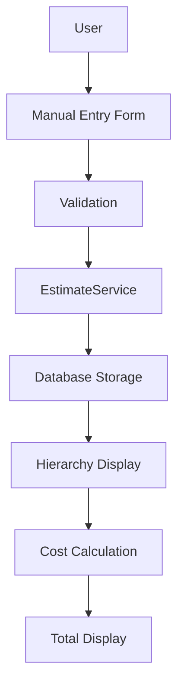
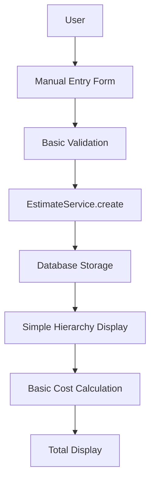
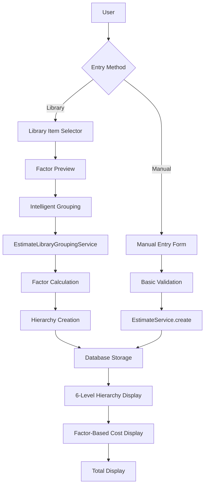

# Current Estimate System Impact Analysis

## Overview

This document analyzes how the current estimate system will be affected by the library integration implementation. It examines the existing codebase structure, identifies required changes, and explains the transformation process from the current manual system to the new library-driven approach.

## Current Estimate System Analysis

### 1. Database Schema Structure

#### Current Schema (3-Level Hierarchy)
```sql
-- Current estimate structure
estimate_structures (
  id UUID PRIMARY KEY,
  project_id UUID REFERENCES projects(id),
  name VARCHAR(255),
  description TEXT,
  sort_order INTEGER,
  created_at TIMESTAMP,
  updated_at TIMESTAMP
);

estimate_elements (
  id UUID PRIMARY KEY,
  project_id UUID REFERENCES projects(id),
  structure_id UUID REFERENCES estimate_structures(id),
  name VARCHAR(255),
  description TEXT,
  sort_order INTEGER,
  created_at TIMESTAMP,
  updated_at TIMESTAMP
);

estimate_detail_items (
  id UUID PRIMARY KEY,
  project_id UUID REFERENCES projects(id),
  element_id UUID REFERENCES estimate_elements(id),
  name VARCHAR(255),
  description TEXT,
  quantity DECIMAL(10,2),
  unit VARCHAR(50),
  rate DECIMAL(10,2),
  amount DECIMAL(10,2),
  sort_order INTEGER,
  created_at TIMESTAMP,
  updated_at TIMESTAMP
);
```

#### Legacy Support
```sql
-- Legacy single-table support (still used in some areas)
estimate_items (
  id UUID PRIMARY KEY,
  project_id UUID REFERENCES projects(id),
  code VARCHAR(50),
  name VARCHAR(255),
  description TEXT,
  quantity DECIMAL(10,2),
  unit VARCHAR(50),
  rate DECIMAL(10,2),
  amount DECIMAL(10,2),
  created_at TIMESTAMP,
  updated_at TIMESTAMP
);
```

### 2. Current Service Layer

#### EstimateService Implementation
```typescript
// Current EstimateService (simplified)
class EstimateService {
  // Structure operations
  static async createStructure(data: CreateStructureData): Promise<EstimateStructure>
  static async updateStructure(id: string, data: UpdateStructureData): Promise<EstimateStructure>
  static async deleteStructure(id: string): Promise<void>
  
  // Element operations
  static async createElement(data: CreateElementData): Promise<EstimateElement>
  static async updateElement(id: string, data: UpdateElementData): Promise<EstimateElement>
  static async deleteElement(id: string): Promise<void>
  
  // Detail item operations
  static async createDetailItem(data: CreateDetailItemData): Promise<EstimateDetailItem>
  static async updateDetailItem(id: string, data: UpdateDetailItemData): Promise<EstimateDetailItem>
  static async deleteDetailItem(id: string): Promise<void>
  
  // Hierarchy operations
  static async getProjectEstimate(projectId: string): Promise<ProjectEstimate>
  static async calculateTotals(projectId: string): Promise<EstimateTotals>
}
```

#### Current Data Types
```typescript
// Current estimate types
interface EstimateStructure {
  id: string;
  projectId: string;
  name: string;
  description?: string;
  sortOrder: number;
  createdAt: Date;
  updatedAt: Date;
}

interface EstimateElement {
  id: string;
  projectId: string;
  structureId: string;
  name: string;
  description?: string;
  sortOrder: number;
  createdAt: Date;
  updatedAt: Date;
}

interface EstimateDetailItem {
  id: string;
  projectId: string;
  elementId: string;
  name: string;
  description?: string;
  quantity: number;
  unit: string;
  rate: number;
  amount: number;
  sortOrder: number;
  createdAt: Date;
  updatedAt: Date;
}
```

### 3. Current UI Components

#### EstimateTab Component
```typescript
// Current EstimateTab.tsx structure
const EstimateTab = ({ projectId }: { projectId: string }) => {
  const [structures, setStructures] = useState<EstimateStructure[]>([]);
  const [selectedStructure, setSelectedStructure] = useState<string | null>(null);
  
  // Current functionality:
  // - Display hierarchical estimate structure
  // - Manual CRUD operations for structures/elements/items
  // - Basic cost calculations
  // - Import/export functionality
  
  return (
    <div className="space-y-6">
      <EstimateHeader />
      <EstimateStructureList />
      <EstimateElementList />
      <EstimateDetailItemList />
      <AddEstimateDialog />
    </div>
  );
};
```

#### AddEstimateDialog Component
```typescript
// Current AddEstimateDialog.tsx
const AddEstimateDialog = ({ 
  open, 
  onClose, 
  projectId, 
  parentType, 
  parentId 
}: AddEstimateDialogProps) => {
  // Current functionality:
  // - Manual form entry only
  // - Basic validation
  // - Simple CRUD operations
  
  return (
    <Dialog open={open} onOpenChange={onClose}>
      <DialogContent>
        <DialogHeader>
          <DialogTitle>Add Estimate Item</DialogTitle>
        </DialogHeader>
        <ManualEntryForm />
      </DialogContent>
    </Dialog>
  );
};
```

### 4. Current API Endpoints

#### Estimate API Routes
```typescript
// Current API structure
/api/projects/[projectId]/estimate-import/route.ts
- POST: Import estimates from external sources
- Handles Excel/CSV import
- Basic validation and processing

/api/estimates/ (implicit from services)
- CRUD operations for structures
- CRUD operations for elements  
- CRUD operations for detail items
- Hierarchy retrieval
- Cost calculations
```

### 5. Current Data Flow



## Impact of Library Integration

### 1. Database Schema Changes

#### New Schema (6-Level Hierarchy)
```sql
-- Enhanced estimate_elements for multi-level hierarchy
ALTER TABLE estimate_elements ADD COLUMN library_division_id UUID REFERENCES divisions(id);
ALTER TABLE estimate_elements ADD COLUMN library_section_id UUID REFERENCES sections(id);
ALTER TABLE estimate_elements ADD COLUMN library_assembly_id UUID REFERENCES assemblies(id);
ALTER TABLE estimate_elements ADD COLUMN hierarchy_level INTEGER; -- 1=Element, 2=Division, 3=Section, 4=Assembly
ALTER TABLE estimate_elements ADD COLUMN parent_element_id UUID REFERENCES estimate_elements(id);
ALTER TABLE estimate_elements ADD COLUMN library_code VARCHAR(20);
ALTER TABLE estimate_elements ADD COLUMN library_path TEXT;

-- Enhanced estimate_detail_items with library references
ALTER TABLE estimate_detail_items ADD COLUMN library_item_id UUID REFERENCES library_items(id);
ALTER TABLE estimate_detail_items ADD COLUMN library_division_id UUID REFERENCES divisions(id);
ALTER TABLE estimate_detail_items ADD COLUMN library_section_id UUID REFERENCES sections(id);
ALTER TABLE estimate_detail_items ADD COLUMN library_assembly_id UUID REFERENCES assemblies(id);
ALTER TABLE estimate_detail_items ADD COLUMN library_code VARCHAR(20);
ALTER TABLE estimate_detail_items ADD COLUMN library_path TEXT;
ALTER TABLE estimate_detail_items ADD COLUMN factor_breakdown JSONB; -- Store factor calculations

-- New library usage tracking
CREATE TABLE estimate_library_selections (
  id UUID PRIMARY KEY DEFAULT gen_random_uuid(),
  project_id UUID REFERENCES projects(id),
  library_item_id UUID REFERENCES library_items(id),
  estimate_detail_item_id UUID REFERENCES estimate_detail_items(id),
  selected_at TIMESTAMP DEFAULT NOW(),
  selected_by UUID REFERENCES auth.users(id),
  quantity DECIMAL(10,2),
  calculated_rate DECIMAL(10,2),
  factor_breakdown JSONB
);
```

### 2. Service Layer Enhancements

#### Enhanced EstimateService
```typescript
// Enhanced EstimateService with library integration
class EstimateService {
  // Existing methods remain (backward compatibility)
  // + New library integration methods
  
  // Library integration methods
  static async createFromLibraryItems(
    projectId: string,
    structureId: string,
    elementId: string,
    libraryItems: LibraryItem[]
  ): Promise<EstimateCreationResult>;
  
  static async createHierarchyFromLibraryItems(
    projectId: string,
    libraryItems: LibraryItem[]
  ): Promise<EstimateHierarchyResult>;
  
  // Enhanced creation methods
  static async createElement(data: CreateElementData): Promise<EstimateElement> {
    // Now supports:
    // - Library references
    // - Hierarchy levels
    // - Parent relationships
    // - Library codes and paths
  }
  
  static async createDetailItem(data: CreateDetailItemData): Promise<EstimateDetailItem> {
    // Now supports:
    // - Library item references
    // - Factor-based rate calculation
    // - Factor breakdown storage
    // - Library traceability
  }
  
  // New calculation methods
  static async calculateFactorBasedRate(
    libraryItemId: string,
    projectId: string
  ): Promise<FactorCalculationResult>;
  
  static async recalculateFromLibraryChanges(
    projectId: string,
    libraryItemIds: string[]
  ): Promise<RecalculationResult>;
}
```

#### New EstimateLibraryGroupingService
```typescript
// New service for intelligent grouping
class EstimateLibraryGroupingService {
  static async createEstimateFromLibraryItems(
    projectId: string,
    libraryItems: LibraryItem[]
  ): Promise<EstimateCreationResult>;
  
  static async groupByHierarchy(
    libraryItems: LibraryItem[]
  ): Promise<GroupedLibraryStructure>;
  
  static async createHierarchyElements(
    projectId: string,
    structureId: string,
    parentElementId: string,
    groupedItems: GroupedLibraryStructure
  ): Promise<EstimateElement[]>;
}
```

#### New FactorCalculatorService
```typescript
// New service for factor-based calculations
class FactorCalculatorService {
  static async calculateItemCost(
    libraryItemId: string,
    projectId: string
  ): Promise<FactorCalculation>;
  
  static async processMaterialFactors(
    factors: MaterialFactor[],
    projectRates: ProjectRates
  ): Promise<ProcessedMaterialFactors>;
  
  static async processLaborFactors(
    factors: LaborFactor[],
    projectRates: ProjectRates
  ): Promise<ProcessedLaborFactors>;
  
  static async processEquipmentFactors(
    factors: EquipmentFactor[],
    projectRates: ProjectRates
  ): Promise<ProcessedEquipmentFactors>;
}
```

### 3. Enhanced Data Types

#### New/Enhanced Types
```typescript
// Enhanced EstimateElement with library support
interface EstimateElement {
  id: string;
  projectId: string;
  structureId: string;
  name: string;
  description?: string;
  sortOrder: number;
  
  // New library integration fields
  libraryDivisionId?: string;
  librarySectionId?: string;
  libraryAssemblyId?: string;
  hierarchyLevel: number; // 1=Element, 2=Division, 3=Section, 4=Assembly
  parentElementId?: string;
  libraryCode?: string;
  libraryPath?: string;
  
  createdAt: Date;
  updatedAt: Date;
  
  // Populated relationships
  children?: EstimateElement[];
  parent?: EstimateElement;
  detailItems?: EstimateDetailItem[];
}

// Enhanced EstimateDetailItem with library support
interface EstimateDetailItem {
  id: string;
  projectId: string;
  elementId: string;
  name: string;
  description?: string;
  quantity: number;
  unit: string;
  rate: number;
  amount: number;
  sortOrder: number;
  
  // New library integration fields
  libraryItemId?: string;
  libraryDivisionId?: string;
  librarySectionId?: string;
  libraryAssemblyId?: string;
  libraryCode?: string;
  libraryPath?: string;
  factorBreakdown?: FactorBreakdown;
  
  createdAt: Date;
  updatedAt: Date;
  
  // Populated relationships
  libraryItem?: LibraryItem;
  element?: EstimateElement;
}

// New types for library integration
interface FactorBreakdown {
  materials: ProcessedMaterialFactor[];
  labor: ProcessedLaborFactor[];
  equipment: ProcessedEquipmentFactor[];
  totals: {
    materialCost: number;
    laborCost: number;
    equipmentCost: number;
    totalRate: number;
  };
}

interface EstimateCreationResult {
  structures?: EstimateStructure[];
  elements: EstimateElement[];
  detailItems: EstimateDetailItem[];
  librarySelections: EstimateLibrarySelection[];
}
```

### 4. UI Component Enhancements

#### Enhanced EstimateTab
```typescript
// Enhanced EstimateTab.tsx with library integration
const EstimateTab = ({ projectId }: { projectId: string }) => {
  const [structures, setStructures] = useState<EstimateStructure[]>([]);
  const [hierarchyView, setHierarchyView] = useState<'flat' | 'hierarchical'>('hierarchical');
  const [showLibraryLinks, setShowLibraryLinks] = useState(true);
  
  // Enhanced functionality:
  // - 6-level hierarchy display
  // - Library item indicators
  // - Factor breakdown views
  // - Intelligent grouping display
  // - Library sync status
  
  return (
    <div className="space-y-6">
      <EstimateHeader />
      <EstimateViewControls />
      <HierarchicalEstimateView />
      <LibraryIntegrationPanel />
      <EnhancedAddEstimateDialog />
    </div>
  );
};
```

#### Enhanced AddEstimateDialog
```typescript
// Enhanced AddEstimateDialog.tsx with library integration
const AddEstimateDialog = ({ 
  open, 
  onClose, 
  projectId, 
  parentType, 
  parentId 
}: AddEstimateDialogProps) => {
  const [activeTab, setActiveTab] = useState<'manual' | 'library'>('library');
  const [selectedLibraryItems, setSelectedLibraryItems] = useState<LibraryItem[]>([]);
  
  // Enhanced functionality:
  // - Two-tab interface (Manual | Library)
  // - Library item selection
  // - Factor preview
  // - Intelligent grouping preview
  // - Cost calculation preview
  
  return (
    <Dialog open={open} onOpenChange={onClose}>
      <DialogContent className="max-w-6xl">
        <DialogHeader>
          <DialogTitle>Add Estimate Item</DialogTitle>
        </DialogHeader>
        
        <Tabs value={activeTab} onValueChange={setActiveTab}>
          <TabsList className="grid w-full grid-cols-2">
            <TabsTrigger value="manual">Manual Entry</TabsTrigger>
            <TabsTrigger value="library">From Library</TabsTrigger>
          </TabsList>
          
          <TabsContent value="manual">
            <ManualEntryForm />
          </TabsContent>
          
          <TabsContent value="library">
            <LibraryItemSelector />
            <FactorPreview />
            <IntelligentGroupingPreview />
          </TabsContent>
        </Tabs>
      </DialogContent>
    </Dialog>
  );
};
```

#### New Components
```typescript
// New LibraryItemSelector.tsx
const LibraryItemSelector = ({ 
  onItemSelect, 
  projectId, 
  allowMultiple 
}: LibraryItemSelectorProps) => {
  // Functionality:
  // - Library hierarchy browsing
  // - Search and filtering
  // - Multi-selection support
  // - Factor preview integration
  
  return (
    <div className="grid grid-cols-1 lg:grid-cols-2 gap-6">
      <LibraryBrowser />
      <SelectedItemsList />
    </div>
  );
};

// New FactorPreview.tsx
const FactorPreview = ({ 
  items, 
  projectId 
}: FactorPreviewProps) => {
  // Functionality:
  // - Real-time factor calculation
  // - Cost breakdown display
  // - Material/Labor/Equipment details
  // - Total cost summary
  
  return (
    <div className="space-y-4">
      <h3>Cost Breakdown Preview</h3>
      {items.map(item => (
        <FactorBreakdownCard key={item.id} item={item} />
      ))}
    </div>
  );
};

// New HierarchicalEstimateView.tsx
const HierarchicalEstimateView = ({ 
  projectId 
}: HierarchicalEstimateViewProps) => {
  // Functionality:
  // - 6-level hierarchy display
  // - Collapsible tree structure
  // - Library item indicators
  // - Factor breakdown tooltips
  // - Drag-and-drop reordering
  
  return (
    <div className="space-y-2">
      {structures.map(structure => (
        <EstimateStructureNode key={structure.id} structure={structure} />
      ))}
    </div>
  );
};
```

### 5. API Enhancements

#### New API Endpoints
```typescript
// New library integration endpoints
/api/estimates/library/route.ts
- POST: Create estimates from library items
- Body: { projectId, libraryItems, targetStructure?, targetElement? }
- Response: EstimateCreationResult

/api/estimates/library/calculate/route.ts
- POST: Calculate factor-based costs
- Body: { libraryItemId, projectId, quantity? }
- Response: FactorCalculation

/api/estimates/hierarchy/route.ts
- GET: Get hierarchical estimate structure
- Query: { projectId, includeLibraryData? }
- Response: HierarchicalEstimate

/api/estimates/library/sync/route.ts
- POST: Sync estimates with library changes
- Body: { projectId, libraryItemIds? }
- Response: SyncResult

/api/estimates/factors/route.ts
- GET: Get factor breakdown for estimate item
- Query: { estimateDetailItemId }
- Response: FactorBreakdown
```

#### Enhanced Existing Endpoints
```typescript
// Enhanced estimate import endpoint
/api/projects/[projectId]/estimate-import/route.ts
- POST: Enhanced with library integration
- Now supports:
  - Library item matching
  - Factor-based cost calculation
  - Intelligent grouping
  - Hierarchy creation
```

### 6. Data Flow Transformation

#### Current Flow (Manual)


#### New Flow (Library-Integrated)


## Migration Strategy

### 1. Phase 1: Schema Migration
```sql
-- Add new columns to existing tables
ALTER TABLE estimate_elements ADD COLUMN library_division_id UUID;
ALTER TABLE estimate_elements ADD COLUMN library_section_id UUID;
-- ... (other columns)

-- Create new tables
CREATE TABLE estimate_library_selections (...);

-- Create indexes
CREATE INDEX idx_estimate_elements_library_division ON estimate_elements(library_division_id);
-- ... (other indexes)
```

### 2. Phase 2: Service Enhancement
- Keep existing EstimateService methods for backward compatibility
- Add new library integration methods
- Implement new services (EstimateLibraryGroupingService, FactorCalculatorService)
- Add data migration utilities

### 3. Phase 3: UI Enhancement
- Update existing components to support new features
- Add new library integration components
- Implement progressive enhancement (manual first, then library)
- Add feature flags for gradual rollout

### 4. Phase 4: API Extension
- Add new library integration endpoints
- Enhance existing endpoints with library support
- Implement proper error handling and validation
- Add performance optimizations

## Backward Compatibility

### 1. Database Level
- All existing columns remain unchanged
- New columns are nullable and optional
- Legacy estimate_items table support maintained
- Existing data continues to work

### 2. Service Level
- All existing EstimateService methods remain
- New methods added without breaking changes
- Existing API contracts maintained
- Progressive enhancement approach

### 3. UI Level
- Existing manual entry continues to work
- New library features are additive
- Users can choose between manual and library entry
- Gradual feature introduction

### 4. Data Level
- Existing estimates remain functional
- New library features available for new estimates
- Migration tools for upgrading existing estimates
- Full audit trail maintained

## Benefits of the Integration

### 1. Enhanced Functionality
- **6-Level Hierarchy**: Complete library structure preservation
- **Intelligent Grouping**: Automatic organization of library items
- **Factor-Based Costing**: Real-time accurate cost calculations
- **Library Traceability**: Full linkage between estimates and library

### 2. Improved User Experience
- **Faster Estimate Creation**: Select from library vs. manual entry
- **Consistent Pricing**: Standardized rates across all estimates
- **Real-Time Calculations**: Instant cost previews and breakdowns
- **Visual Hierarchy**: Clear organization of complex estimates

### 3. Better Data Management
- **Centralized Library**: Single source of truth for all items
- **Automatic Updates**: Library changes reflect in estimates
- **Complete Audit Trail**: Track all changes and calculations
- **Performance Optimization**: Efficient hierarchical queries

### 4. Business Value
- **Reduced Errors**: Eliminate manual entry mistakes
- **Improved Accuracy**: Factor-based calculations vs. estimates
- **Better Consistency**: Standardized approach across projects
- **Enhanced Reporting**: Detailed cost breakdowns and analytics

## Potential Challenges and Solutions

### 1. Performance Considerations
**Challenge**: 6-level hierarchy queries might be slow
**Solution**: 
- Proper indexing strategy
- Materialized views for common queries
- Caching at application level
- Pagination for large datasets

### 2. Data Migration
**Challenge**: Existing estimates need library linkage
**Solution**:
- Gradual migration tools
- Fuzzy matching algorithms
- Manual verification process
- Rollback mechanisms

### 3. User Adoption
**Challenge**: Users familiar with manual entry
**Solution**:
- Progressive enhancement
- Training and documentation
- Dual-mode interface
- Feature flags for gradual rollout

### 4. Complexity Management
**Challenge**: System becomes more complex
**Solution**:
- Clear separation of concerns
- Comprehensive testing
- Good documentation
- Monitoring and alerting

## Conclusion

The library integration will transform the estimate system from a simple manual entry system to a sophisticated, library-driven cost calculation platform. While the changes are significant, the implementation strategy ensures:

1. **Backward Compatibility**: Existing functionality remains intact
2. **Progressive Enhancement**: New features are additive, not disruptive
3. **Improved Accuracy**: Factor-based calculations replace manual estimates
4. **Enhanced Productivity**: Library selection is faster than manual entry
5. **Better Consistency**: Standardized approach across all projects

The integration will require careful planning and execution, but the benefits far outweigh the complexity. The result will be a more accurate, efficient, and user-friendly estimate system that leverages the power of the centralized library while maintaining the flexibility users expect.